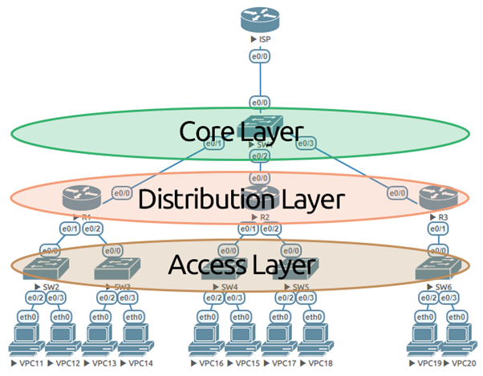
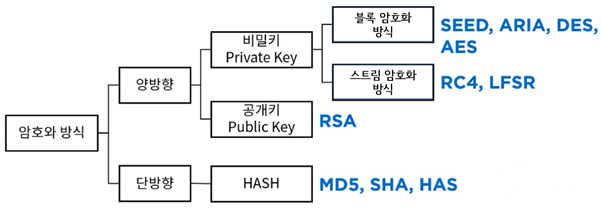

# 5과목 정보시스템 구축 관리 1~24

## 1. 소프트웨어 개발 방법론

- 구조적 방법론
  - 정형화된 분석 절차

▶ 타당성 검토 → 계획 → 요구사항 **분**석 → **설**계 → **구**현 → **테**스트 → **유**지보수 단계

- 정보공학 방법론
  - 정보 시스템의 개발
- 객체지향 방법론

\- 현실 세계의 개체(Entity)를 기계의 부품처럼 하나의 객체(Object)로 만들어, 소프트웨어를 개발할 때 기계의 부품을 조립하듯이 객체들을 조립해서 필요한 소프트웨어를 구현하는 방법론

▶ 구성 요소: 객체(Object), 클래스(Class), 메시지(Message), 메서드(Method) 등

▶ 기본 원칙: **캡**슐화, **상**속성, **다**형성, **추**상화, **정**보 은닉 → #**캡상다추정**

- 컴포넌트 기반(CBD; Component Based Design) 방법론
  - 컴포넌트를 조합
  - 컴포넌트 및 소프트웨어의 재사용
  - 확장성
  - 생산성 향상
- 애자일 방법론
  - 유연하게 대응, 일정한 주기를 반복
  - \# **X**P(eXtreme Programming), **스**크럼(Scrum), **칸**반(Kanban), **크**리스탈(Crystal) 등
- 제품 계열 방법론
  - 특정 제품

## 2. 비용 산정 기법

- 소프트웨어 비용 산정의 개요
  - 하향식 비용 산정 기법, 상향식 비용 산정 기법
- 소프트웨어 비용 결정 요소
  - 프로젝트 요소
    - 제품의 복잡도 : 문제점들의 난이도를 의미
    - 시스템 크기 : 시스템의 크기를 의미
    - 요구되는 신뢰도 : 필요한 기능을 수행하는 정도를 의미
  - 자원 요소
    - 인적 지원 : 관련자들이 갖춘 능력 혹은 자질
    - 하드웨어 지원 : 보조 장비를 의미
    - 소프트웨어 자원 : 개발 지원 도구
  - 생산성 요소
    - 개발자 능력
    - 개발 기간

## 3. 하향식 비용 산정 기법

- 하향식 비용 산정 기법의 개요

\- 과거의 유사한 경험을 바탕으로 전문 지식이 많은 개발자들이 참여한 회의를 통해 비용을 산정하는 비과학적인 방법

\# 전문가 감정 기법, 델파이 기법

- 전문가 감정 기법
  - 두 명 이상의 전문가에게 비용 산정을 의뢰
  - 개인적이고 주관적
- 델파이 기법
  - 전문가 감정 기법의 주관적인 편견을 보완
  - 한 명의 조정자와 여러 전문가의 의견을 종합

## 4. 상향식 비용 산정 기법

- 상향식 비용 산정 기법의 개요

 \- 프로젝트의 세부적인 작업 단위별로 비용을 산정한 후 집계하여 전체 비용을 산정하는 방법

 \# LOC(원시 코드 라인 수) 기법, 개발 단계별 인월수(Effort Per Task), 

수학적 산정 기법(COCOMO 모형, Putnam 모형, 기능점수 모형)

- LOC(원시 코드 라인 수, source Line Of Code) 기법
  - 비관치, 낙관치, 기대치를 측정
  - ex) 라인 수가 50000 라인 월평균 생산성 200라인, 프로그래머가 10인
    - 개발 소요기간 50000/200/10 = 25 개월
- 개발 단계별 인월수(Effort Per Task) 기법
  - LOC 기법을 보완하기 위한 기법
- COCOMO(constructive Cost Model) 모형
  - 소프트웨어 개발비 견적에 널리 통용
  - 성격에 따라 비용이 다르게 산정

**▶ COCOMO****의 소프트웨어 개발 유형** **★ __** **20년 1, 2, 3회 기출문제**

| **유형**                    | **내용**                                                     |
| --------------------------- | ------------------------------------------------------------ |
| 조직형  **Organic**         | 기관 내부에서 개발된 중, 소규모의  소프트웨어로 일괄 자료 처리나 과학 기술 계산용, 비즈니스 자료 처리용으로 **5만(50KDSI) 라인 이하**의 소프트웨어를 개발하는 유형 |
| 반분리형  **Semi-Detached** | 트랜잭션 처리 시스템이나 운영체제, 데이터베이스  관리 시스템 등의 **30만(300KDSI) 라인 이하**의  소프트웨어를 개발하는 유형 |
| 내장형  **Embedded**        | 최대형 규모의 트랜잭션 처리 시스템이나, 운영체제 등의 **30만(300KDSI) 라인 이상**의 소프트웨어를 개발하는  유형 |

 

**▶ COCOMO** **모형의 종류 \**★\****

| **종류**                        | **내용**                                                     |
| ------------------------------- | ------------------------------------------------------------ |
| 기본형 COCOMO  **Basic**        | 소프트웨어의 크기(생산  코드 라인 수)와 개발 유형만을 이용하여 비용을 산정하는 모형 |
| 중간형 COCOMO  **Intermediate** | 기본형 COCOMO의 공식을  토대로 사용하나,  제품, 컴퓨터, 개발요원, 프로젝트 특성의 15가지  요인에 의해  비용을 산정하는 모형 |
| 발전형 COCOMO  **Detailed**     | 중간형 COCOMO를 보완하여  만들어진 방법으로, 개발 공정별로 보다 자세하고 정확하게 노력을 산출하여 비용을 산정하는  모형  → 소프트웨어 환경과 구성 요소가 사전에  정의되어 있어야 하며, 개발 과정의 후반부에 주로 적용함 |

- Putanm 모형
  - 노력의 분포
  - 생명 주기 예측 모형
  - Rayleigh-Norden 곡선의 노력 분포도를 기초
  - SLIM : 자동화 추정 도구
- 기능 점수(FP; Funtion Point) 모형
  - 요인별로 가중치를 부여, 요인별 가중치를 합산, 총 기능점수와 영향도를 이용
  - ESTIMACS : 자동화 추정 도구
- 기능점수 모형에서 비용산정에 이용되는 요소
  - 자료 입력(입력 양식)
  - 정보 출력(출력 보고서)
  - 명령어 (사용자 질의수)
  - 데이터 파일
  - 필요한 외부 루틴과의 인터페이스
- 프로젝트 관리
  - 일정 관리
  - 비용 관리
  - 인력 관리
  - 위험 관리
  - 품질 관리

## 5. 소프트웨어 개발 표준

- ISO/IEC 12207
  - 표준 소프트웨어 생명 주기 프로세스
  - 기본 생명 주기 프로세스, 조직 생명 주기 프로세스, 지원 생명 주기 프로세스
- CMMI(Capability Maturity Model Integration, 능력 성숙도 통합 모델)
  - 업무 능력 및 조직의 성숙도를 평가

▶ **프로세스 성숙도 5단계 __ 20년 1, 2회 기출문제**

| **단계**                                    | **프로세스**          | **특징**                                         |
| ------------------------------------------- | --------------------- | ------------------------------------------------ |
| **초**기(Initial)                           | 정의된 프로세스  없음 | 작업자 능력에 따라 성공 여부 결정                |
| **관**리(Managed)                           | 규칙화된 프로세스     | 특정한 프로젝트 내의 프로세스 정의 및 수행       |
| **정**의(Defined)                           | 표준화된 프로세스     | 조직의 표준 프로세스를 활용하여 업무 수행        |
| 정**량**적  관리  (Quantitatively  Managed) | 예측 가능한 프로세스  | 프로젝트를 정량적으로 관리 및 통제               |
| **최**적화(Optimizing)                      | 지속적 개선 프로세스  | 프로세스 역량 향상을 위해 지속적인 프로세스 개선 |

- SPICE(Software Process Improvement and Capability dEtermination)
  - 소프트웨어 프로세스를 평가 및 개선하는 국제 표준, ISO/IEC 15504
  - 목적

▶ **SPICE****의 목적**

 -프로세스 개선을 위해 개발 기관이 스스로 평가

 -기관에서 지정한 요구조건의 만족여부를 개발 조직이 스스로 평가

 -계약 체결을 위해 수탁 기관의 프로세스를 평가

 

▶ **SPICE****의 5개 프로세스 범주**

 -**고**객-공급자(Customer-Supplier) 프로세스, **공**학(Engineering) 프로세스, **지**원(Support) 프로세스, **관**리(Management) 프로세스, **조**직(Organization) 프로세스

 \#**고공지관조**

 

▶ **SPICE****의 프로세스 수행 능력 단계 \**★\****

| **단계**                 | **특징**                                                     |
| ------------------------ | ------------------------------------------------------------ |
| **불**완전  (Incomplete) | 프로세스가 구현되지 않았거나 목적을 달성하지 못한 단계       |
| **수**행  (Performed)    | 프로세스가 수행되고 목적이 달성된 단계                       |
| **관**리  (Managed)      | 정의된 자원의 한도 내에서 그 프로세스가 작업 산출물을 인도하는 단계 |
| **확**립  (Established)  | 소프트웨어 공학 원칙에 기반하여 정의된 프로세스가 수행되는 단계 |
| **예**측  (Predictable)  | 프로세스가 목적 달성을 위해 통제되고,  양적인 측정을 통해서 일관되게 수행되는 단계 |
| **최**적화  (Optimizing) | 프로세스 수행을 최적화하고, 지속적인  개선을 통해 업무 목적을 만족시키는 단계 |

 \#**불수관 확예최**

## 6. 테일러링, 프레임워크

- 소프트웨어 개발 방법록 테일러링의 개요
  - ▶ **수행절차**: 프로젝트 특징 **정**의 → **표**준 프로세스 선정 및 검증 → **상**위 수준의 커스터마이징 → **세**부 커스터마이징 → 테일러링 **문**서화

- 소프트웨어 개발 방법론 테일러링 고려사항
  - 내부적 요건 : 목표 환경 등
  - 외부적 요건 : 법적 제약사항, 국제 표준 품질기준
- 스프링 프레임워크
  - JAVA 플랫폼
  - 전자정부 표준 프레임워크의 기반 기술
- 전자정부 프레임워크
  - 대한민국의 공공부문 정보화 사업 시
- 닷넷 프레임워크
  - 마이크로소프트, 공통 언어 런타임(CLR)

## 7. 네트워크 구축

- 버스형
  - 한 개의 통신 회선, 여러 대의 단말장치가 연결
- 계층형
  - 분산 처리 시스템
- 링형
  - 서루 이웃하는 것 끼리 포인트 투 포인트 -> LAN에서 사용
  - 분산 및 집중 제어 모두 가능
  - 어느 하나라도 고장나면 전체 통신망에 영향
- 성형
  - 중앙에 중앙 컴퓨터, 중앙 집중식의 네트워크 구성 형태
  - 포인트 투 포인트 방식
  - 단말장치의 추가와 제거가 쉽지만, 중앙 컴퓨터가 고장나면 전체 통신망의 기능이 정지
- 망형
  - 많은 양의 통신을 필요로 하는 경우 유리
  - 통신 회선의 총 경로가 가장 긺
- 네트워크 분류

| **분류**                                            | **설명**                                                     |
| --------------------------------------------------- | ------------------------------------------------------------ |
| **근거리 통신망**  (**LAN**;  Local  Area  Network) | - 비교적 가까운 거리에 있는 컴퓨터, 프린터, 테이프 등과 같은 자원을 연결하여 구성하며 주로 자원 공유의 목적으로 사용  - 사이트 간의 거리가 짧아 데이터의 전송 속도가 빠르고, 에러  발생율이 낮음  # 주로 **버스형, 링형 구조** 사용 |
| **원거리 통신망**  (**WAN**;  Wide  Area  Network)  | - 대륙과 대륙 같이 멀리 떨어진 사이트들을 연결하여 구성  - 사이트 간의 거리가 멀기 때문에 통신 속도가 느리고, 에러  발생율이 높음 |

## 8. 스위치

- 스위치 분류

| **스위치** | **특징**                                                     |
| ---------- | ------------------------------------------------------------ |
| L2  스위치 | - OSI 2계층(Da)에 속하는 장비  - 일반적으로 부르는 스위치는 L2 스위치를 의미  - MAC 주소를 기반으로 프레임(Frame)을 전송  - 동일 네트워크 간의 연결만 가능 |
| L3  스위치 | - OSI 3계층(Ne)에 속하는 장비  - L2 스위치에 라우터 기능이 추가된 것  - IP 주소를 기반으로 패킷(Packet)을 전송  - 서로 다른 네트워크 간의 연결이 가능 |
| L4  스위치 | - OSI 4계층(T)에 속하는 장비  - 로드밸런서(Load Balancer)가 달린 L3 스위치  - IP 주소 및 TCP/UDP를 기반으로 사용자들의 요구를  서버의 부하가 적은 곳에 배분하는 로드밸런싱 기능을 제공 |
| L7  스위치 | - OSI 7계층(A)에 속하는 장비  - IP 주소 및 TCP/UDP 포트 정보에 **패킷 내용까지  참조**하여 세밀하게 로드밸런싱함 |

- 스위칭 방식
  - Store and Forwarding : 데이터를 모두 받은 후 스위칭
  - Cut-through : 데이터의 목적지 주소만을 확인한 후 바로 스위칭
  - Fragment Free : 위의 두 가지 방식의 장점을 결합
- 백본 스위치
  - 모든 패킷이 지나가는 네트워크의 중심에 배치
- Hierarchical 3 Layer 모델

| **계층**                                      | **특징**                                                     |
| --------------------------------------------- | ------------------------------------------------------------ |
| **코어 계층**  (Core  Layer)                  | ▶ 디스트리뷰션 계층에서 오는 통신을 집약해 인터넷에 연결하는 계층으로, **백본 계층**이라고도 함  - 전자우편, 인터넷 접속, 화상 회의 등의 기능을 수행  - 백본 스위치 사용 |
| **디스트리뷰션  계층**  (Distribution  Layer) | ▶ 액세스 계층의 장치들이 연결되는 지점으로, 액세스 계층으로  오는 통신을 집약해서 코어 계층으로 전송  - LAN 간에 **라우팅(경로 설정) 기능**을 수행  - 라우터, L3 스위치 사용 → IP, 패킷(Packet) |
| **액세스 계층**  (Access  Layer)              | ▶ 사용자가 네트워크에 접속할 때 **최초로 연결되는 지점**으로, 사용자들로부터 오는 통신을 집약해서 디스트리뷰션 계층으로 전송  - 액세스 계층에 배치되는 장비는 성능은 낮아도 되지만 포트수는 사용자 수만큼 있어야 함  - L2 스위치 사용 → MAC, 프레임(Frame) |

## 9. 경로 제어, 트래픽 제어

- 경로 제어 프로토콜

| **프로토콜**                                   | **설명**                                                     |
| ---------------------------------------------- | ------------------------------------------------------------ |
| **RIP**  (Routing  Information Protocol) **★** | ▶  IGP(Interior Gateway Protocol)로 **Bellman-Ford 알고리즘**을 이용하여 최적의 경로를 설정하는 **소규모** 프로토콜  -  **최대 홉(Hop) 수를  15홉 이하로 제한**  -  **거리 벡터 라우팅 프로토콜**이라고도 함 |
| **OSPF**  (Open  Shortest Path First) **★**    | ▶ IGP(Interior  Gateway Protocol)로 RIP의  단점 개선을 위해 **daijkstra 알고리즘** 및 **Link Static 기반**으로 최단경로를 찾는 **대규모** 프로토콜 |
| **BGP**  (Border  Gateway Protocol)            | ▶  자치 시스템 간의 라우팅 프로토콜로, EGP(Exterior  Gateway Protocol)의 단점을 보완하기 위해 만들어짐  -  초기에 BGP 라우터들이 연결될  때는 전체 경로를 나타내는 **라우팅 테이블을 교환**하고, 이후에는 변화된 정보만 교환 |

- 트래픽 제어
  - 패킷의 흐름 또는 그 양을 조절하는 기능
- 흐름 제어
  - 송, 수신 측 사이, 패킷의 양이나 속도를 규제

| **종류**                                      | **특징**                                                     |
| --------------------------------------------- | ------------------------------------------------------------ |
| **정지-대기**  (Stop-and-Wait)                | ▶  수신 측의 확인 신호(ACK)를  받은 후에 다음 패킷을 전송하는 방식 → 한번에 하나의 패킷 전송 |
| **슬라이딩 윈도우**  (Sliding  Window)  **★** | ▶ 수시 측의 확인 신호(ACK)를  받지 않더라도 미리 정해진 패킷의 수만큼 연속적으로 전송하는 방식 → 한번에 여러 개 패킷 전송  - 수신 측으로부터 송신한 패킷에 대한 긍정 수신 응답(ACK)이  전달된 경우 윈도우 크기는 증가하고, 수신 측으로부터 부정 수신 응답(NAK)이 전달된 경우 윈도우 크기는 감소함 |

- 폭주(혼잡) 제어
  - 흐름제어가 송, 수신 측 사이의 패킷 수를 제어하는 기능, 혼잡 제어는 네트워크 내의 패킷 수를 조절

| **종류**                               | **특징**                                                     |
| -------------------------------------- | ------------------------------------------------------------ |
| **느린 시작**  (Slow  Start)           | ▶ 윈도우의 크기를 1, 2, 4, 8, … 같이 2배씩 지수적으로 증가시켜 초기에는 느리지만 갈수록 빨라짐  - 전송 데이터의 크기가 임계 값에 도달하면 혼잡 회피 단계로 넘어감 |
| **혼잡 회피**  (Congestion  Avoidance) | ▶  느린 시작의 지수적 증가가 임계 값에 도달하면 혼잡으로 간주하고 회피를  위해 윈도우의 크기를 1씩 선형적으로 증가시켜 혼잡을 예방하는 방식 |

- 교착 상태(Dead Lock) 방지
  - 무한정 기다리는 형상
- 교착 상태 발생의 필요 충분 조건
  - 상호 배제, 점유와 대기, 환형 대기, 비선점

## 10. 소프트웨어 개발 보안

- 소프트웨어 개발 보안 관련 기관

| **활동 주체**                | **역할**                                                     |
| ---------------------------- | ------------------------------------------------------------ |
| **감**리법인                 | - 감리 계획을 수립하고 협의  - 소프트웨어 보안 약점의 제거 여부 및 조치 결과 확인 |
| **사**업자                   | - 소프트웨어 개발 보안 관련 기술 수준 및 적용 계획 명시  - 소프트웨어 개발 보안 관력 인력을 대상으로 교육 실시  - 소프트웨어 개발 보안 가이드를 참조해 개발 → **개발기관** |
| **한**국인터넷진흥원  (KISA) | - 소프트웨어 개발 보안 정책 및 가이드 개발  - 소프트웨어 개발 보안에 대한 기술을 지원하고, 교육과정  및 자격제도를 운영함 → **전문기관** |
| **발**주기관                 | - 소프트웨어 개발 보안 계획 수립  - 소프트웨어 개발 보안 사업자 및 감리법인 선정  - 소프트웨어 개발 보안 준수 여부 점검 |
| **행**정안전부               | - 소프트웨어 개발 보안 정책 총괄 → **정책기관**  - 소프트웨어 개발 보안 관련 법규, 지침, 제도 정비 |

- **소프트웨어 개발 직무별 보안 활동**

  ▶ **프로젝트 관리자**(Project Manager): 응용 프로그램에 대한 보안 전략 전달

  ▶ **요구사항 분석가**(Requirement Specifier): 요구사항 설명 및 정의

  ▶ **아키텍트**(Architect): 보안 기술 문제 이해

  ▶ **설계자**(Designer): 발생할 수 있는 보안 위험에 대해 이해 및 대응

  ▶ **구현 개발자**(Implementer): 시큐어 코딩 표준 준수 개발 및 문서화 **★**

  ▶ **테스트 분석가**(Test Analyst): 요구사항과 구현 결과 반복적 확인

  ▶ **보안 감시자**(Security Auditor): 전체 단계에서 활동 및 보안 보장

## 11. Secure OS

- 보안 기능

| **보호 방법**                                | **특징**                                                     |
| -------------------------------------------- | ------------------------------------------------------------ |
| **암**호적 분리  (Cryptographic  Separation) | 내부 정보를 암호화하는 방법                                  |
| **논**리적 분리  (Logical  Separation)       | 프로세스의 논리적 구역을 지정하여 구역을 벗어나는 행위를 제한하는 방법 |
| **시**간적 분리  (Temporal  Separation)      | 동일 시간에 하나의 프로세스만 수행되도록 하여 동시 실행으로 발생하는  보안 취약점을 제거하는 방법 |
| **물**리적 분리  (Physical  Separation)      | 사용자별로 특정 장비만 사용하도록 제한하는 방법              |

- 참조 모니터
  - 접근통제를 수행
- Secure OS의 보안 기능
  - 식별 및 인증, 임의적 접근통제(DAC), 강제적 접근통제(MAC), 객체 재사용 보호, 완전한 조정, 신뢰 경로, 감사 및 감사기록 축소

## 12. 회복 및 병행제어, 데이터 표준화

- 회복

  - 복구하는 작업

  - ▶ **장애의 유형**

    -**트랜잭션 장애**: 트랜잭션 내부의 비정상적인 상황으로 인해 프로그램 실행이 중지되는 현상

    -**시스템 장애**: 데이터베이스에 손상을 입히지는 않으나 하드웨어 오동작, 소프트웨어의 손상, 교착상태 등에 의해 모든 트랜잭션의 연속적인 수행에 장애를 주는 현상

    -**미디어 장애**: 저장장치인 디스크 블록의 손상이나 디스크 헤드의 충돌 등에 의해 데이터베이스의 일부 또는 전부가 물리적으로 손상된 상태

    ▶ **회복 관리기(Recovery Management)**: DMBS의 구성 요소, 트랜잭션 실행이 성공적으로 완료되지 못하면 트랜잭션이 데이터 베이스에 생성했던 모든 변화를 취소(Undo)시키고, 트랜잭션 수행 이전의 원래 상태로 복구하는 역할 담당

     -메모리 덤프, 로그(Log)를 이용하여 회복 수행

- 병행제어
  - 트랜잭션 간의 상호 작용을 제어
  - 공유 최대화
  - 일관성 유지
  - 시스템 활용도 최대화
  - 응답 시간 최소화

- 병행수행의 문제점
  - 갱신 분실 : 갱신 결과의 일부가 없어지는 현상
  - 비완료 의존성 : 실패한 갱신 결과를 참조
  - 모순성 : 원치 않는 자료를 이용
  - 연쇄 복귀 : 다른 트랜잭션도 함께 Rollback 되는 현상
- 데이터 표준화의 정의
  - 원칙을 수립하고 적용
  - 표준 단어 : 최소 단위의 단어
  - 표준 도메인 : 컬럼을 성질에 따라 그룹핑
  - 표준 코드 : 이미 정의된 코드값
  - 포준 용어
- 데이터 관리 조직
  - 데이터 관리자(DA), 데이터베이스 관리자(DBA)

## 13. 네트워크 관련 신기술

| **IoT**  **(Internet of  Things,**   **사물 인터넷)  ★**     | ▶ 사람과 사물, 사물과 사물 간에 지능 통신을 할 수 있는 M2M(Machine  to Machine)의 개념을 인터넷으로 확장하여 사물은 물론, 현실과 가상 세계의  모든 정보와 상호 작용하는 개념 |
| ------------------------------------------------------------ | ------------------------------------------------------------ |
| **M2M**  **(Machine to Machine)**                            | ▶ 무선 통신을 이용한 기계와 기계 사이의  통신                |
| **Mobile  Computing**  **(****모바일 컴퓨팅)**               | ▶ 휴대형 기기로 이동하면서 자유로이  네트워크에 접속하여 업무를 처리할 수 있는 환경 |
| **Cloud  Computing**  **(****클라우드 컴퓨팅)**     #**사공하**  **★ __ 5-44** | ▶ 각종 컴퓨팅 자원을 중앙 컴퓨터에 두고  인터넷 기능을 갖는 단말기로 언제 어디서나 인터넷을 통해 컴퓨터 작업을 수행할 수 있는 환경  # **사**설 클라우드, **공**용 클라우드, **하**이브리드 클라우드 |
| **Grid  Computing**  **(****그리드 컴퓨팅) ★**               | ▶ 수 많은 컴퓨터를 하나의 컴퓨터처럼 묶어  분산 처리하는 방식 |
| **Mobile Cloud  Computing**  **(MCC;**   **모바일 클라우드 컴퓨팅)** | ▶ 클라우드 서비스를 이용하여 소비자와 소비자의  파트너가 모바일 기기로 클라우드 컴퓨팅 인프라를 구성하여 여러 가지 정보와 자원을 공유하는 ICT(Information  and Communications Technologies) 기술 |
| **Inter-Cloud  Computing**  **(****인터클라우드 컴퓨팅)**    | ▶ 여러 클라우드 서비스 제공자들이 제공하는 클라우드  서비스나 자원을 연결하는 기술 |
| **Mesh Network**  **(****메시 네트워크) ★**                  | ▶ 대규모 디바이스의 네트워크 생성에 최적화  되어 차세대 이동통신, 홈 네트워킹, 공공 안전 등의  특수 목적을 위한 새로운 방식의 네트워크 기술 |
| **WI-SUN**  **(****와이선) ★**                               | ▶ 스마트 그리드와 같은 장거리 무선 통신을 필요로  하는 사물 인터넷 서비스를 위한 저전력 장거리(LPWA; Low-Power Wide Area) 통신  기술 |
| **NDN**  **(Named Data  Networking)**                        | ▶ 콘텐츠 자체의 정보와 라우터 기능만으로  데이터 전송을 수행하는 기술, 콘텐츠 중심 네트워킹(CNN;  Content Centric Networking)과 같은 개념으로 기존의 IP 망을  대체할 새로운 인터넷 아키텍처 |

| **지능형 초연결망**                                          | ▶ 국가망에 소프트웨어 정의 기술을 적용하는 방법              |
| ------------------------------------------------------------ | ------------------------------------------------------------ |
| **NGN**  **(Next  Generation Network,**   **차세대 통신망)** | ▶ ITU-T에서  개발하고 있는 유선망 기반의 차세대 통신망으로, 하나의 망이 인터넷처럼 모든 정보와  서비스를 패킷으로 압축하여 전송 |
| **SDN**  **(Software  Defined Networking,**   **소프트웨어 정의 네트워킹) ★** | ▶ 네트워크를 컴퓨터처럼 모델링하여  여러 사용자가 각각의 소프트웨어들로 네트워킹을 가상화하여 제어하고 관리하는 네트워크 |
| **NFC**  **(Near Field  Communication,** **근거리 무선 통신) ★** | ▶ 고주파(HF;  High Frequency)를 이용한 근거리 무선 통신 기술  - 아주 가까운 거리에서 양방향 통신을 지원하는 RFID(Radio  Frequency Identification) 기술의 일종 |
| **UWB**  **(Ultra  WideBand,** **초광대역)**                 | ▶ 짧은 거리에서 많은 양의 디지털 데이터를  낮은 전력으로 전송하기 위한 무선 기술 |
| **PICONET**   **(****피코넷) ★★**                            | ▶ 여러 개의 독립된 통신장치가 UWB 통신 기술 또는 블루투스 기술을 사용하여 통신망을 형성하는 무선 네트워크 기술 |
| **WBAN**  **(Wireless  Body Area Network)**                  | ▶ Wearable  또는 몸에 심는 형태의 센서나 기기를 무선으로 연결하는 개인 영역 네트워킹 기술 |
| **GIS (Geographic  Information System,** **지리 정보 시스템)** | ▶ 지리적인 자료를 위성을 이용해 모든 사물의  위치 정보를 제공해주는 시스템 |
| **USN**  **(Ubiquitous  Sensor Network,** **유비쿼터스 센서 네트워크) ★** | ▶ 필요한 모든 곳에 RFID 태그를 부착하고 사물의 인식 정보는 물론 주변의 환경정보까지 탐지하여 이를 네트워크에  연결해 정보를 관리하는 것 |
| **SON (Self  Organizing Network,**   **자동 구성 네트워크)** | ▶ 주변 상황에 맞추어 스스로  망을 구성하는 네트워크          |
| **Ad-hoc  Network**  **(****애드 혹 네트워크) ★**            | ▶ 재난 현장과 같이 별도의 고정된  유선망을 구축할 수 없는 장소에서 구성한 네트워크 |
| **Network  Slicing**  **(****네트워크 슬라이싱) ★**          | ▶ 5G 네트워크를  구현하는 중요한 핵심 기술로, 하나의 물리적인 코어 네트워크 인프라를 독립된 다수의  가상 네트워크로 분리하는 네트워크 기술 |
| **저전력 블루투스 기술**  **(BLE;  Bluetooth Low Energy)**   | ▶ 일반 블루투스와 동일한 2.4GHz 주파수 대역을 사용하지만 연결되지 않은 대기 상태에서는 절전모드를 유지하는 기술 |

## 14. 소프트웨어 관련 신기술

| **인공지능**  **(AI;  Artificial Intelligence)**             | ▶ 인간의 두뇌와 같이 컴퓨터 스스로 추론, 학습, 판단 등 인간지능적인 작업을 수행하는 시스템  → 인공지능 개발언어: **리스프(LISP)**, **프롤로그(PROLOG)** |
| ------------------------------------------------------------ | ------------------------------------------------------------ |
| **Neuralink**  **(****뉴럴링크)**                            | ▶ 사람이 인공지능에 대항할 수 있는 더 높은 수준의  기능에 도달하도록 컴퓨터와 뇌를 연결한다는 개념 |
| **Deep  Learning**  **(****딥 러닝)**                        | ▶ 인간의 두뇌를 모델로 만들어진 인공 신경망(ANN; Artificial Neural Network)을 기반으로 하는 기계 학습 기술 |
| **Expert System**  **(****전문가 시스템)**                   | ▶ 의료 진단 등과 같은 특정 분야의 전문가가 수행하는  고도의 업무를 지원하기 위한 컴퓨터 응용 프로그램 |
| **Blockchain**  **(****블록체인)**                           | ▶ P2P(Peer-to-Peer)  네트워크를 이용하여 온라인 금융 거래 정보를 온라인 네트워크 참여자(Peer)의 디지털  장비에 분산 저장하는 기술  → 비트 코인(Bitcoin) |
| **분산 원장 기술**  **(DLT;**   **Distributed  Ledger Technology)** | ▶ 중앙 관리자나 중앙 데이터 저장소가 존재하지  않고 P2P망 내의 참여자들에게 모든 거래 목록이 분산 저장되어 거래가 발생할 때마다 지속적으로  갱신되는 디지털 원장 |
| **Hash**  **(****해시)**                                     | ▶ 임의의 길이의 입력 데이터나 메시지를  고정된 길이의 값이나 키로 변환하는 것 |
| **양자 암호키 분배**  **(QKD;**   **Quantum Key  Distribution)** **★** | ▶ 양자 통신을 위해 비밀키를 분배하여 관리하는  기술로, 두 시스템이 암호 알고리즘 동작을 위한 비밀키를 안전하게 공유하기 위해 양자 암호키  분배 시스템을 설치하여 운용하는 방식으로 활용 |
| **프라이버시 강화 기술**  **(PET;**   **Privacy  Enhancing Technology)** | ▶ 개인정보 위험 관리 기술로, 다양한 사용자 프라이버시 보호 기술을 통칭함 |
| **디지털 저작권 관리**  **(DRM;**   **Digital  Rights Management)** **★** | ▶ 인터넷이나 기타 디지털 매체를 통해 유통되는  데이터의 저작권을 보호하기 위해 데이터의 안전한 배포를 활성화하거나 불법 배포를 방지하기 위한 시스템 |
| **공통 평가 기준**  **(CC; Common  Criteria)**               | ▶ 정보화 순기능 역할을 보장하기 위해 정보화  제품의 정보보호 기능과 이에 대한 사용 환경 등급을 정한 기준 |
| **개인정보 영향평가 제도**  **(PIA;**   **Privacy  Impact Assessment)** | ▶ 개인 정보를 활용하는 새로운 정보시스템의 도입  및 기존 정보시스템의 중요한 변경 시 시스템의 구축, 운영이 기업의 고객은 물론 국민의 사생활에  미칠 영향에 대해 미리 조사, 분석, 평가하는 제도 |
| **Grayware**  **(****그레이웨어) ★★**                        | ▶ 소프트웨어를 제공하는 입장에서는 악의적이지 않은  유용한 소프트웨어라고 주장할 수 있지만 사용자 입장에서는 유용할 수도 있고 악의적일 수도 있는 애드웨어(광고), 트랙웨어(스파이웨어), 악성 공유웨어를 말함  - 정상적인 소프트웨어의 이미지인 백색과 악성 소프트웨어의 이미지인 흑색의 중간(회색)에 해당 |
| **Mashup**  **(****매시업) ★★**                              | ▶ 웹에서 제공하는 정보 및 서비스를 이용하여  새로운 소프트웨어나 서비스, 데이터베이스 등을 만드는 기술  → 콘텐츠를 조합하여 하나의  서비스로 제공하는 웹 사이트 또는 애플리케이션 |
| **리치 인터넷 애플리케이션**  **(RIA; Rich  Internet Application)** | ▶ 플래시 애니메이션 기술과 웹 서버 애플리케이션  기술을 통합하여 기존 HTML보다 역동적인 웹페이지를 제공하는 신개념의 플래시 웹페이지 제작  기술 |
| **Semantic Web**  **(****시맨틱 웹) ★**                      | ▶ 컴퓨터가 사람을 대신하여 정보를 읽고 이해하고  가공하여 새로운 정보를 만들어 낼 수 있도록 이해하기 쉬운 의미를 가진 차세대 지능형 웹 |
| **Vaporware**  **(****증발품)**                              | ▶ 판매 계획 또는 배포 계획은 발표되었으나 실제로  고객에게 판매되거나 배포되지 않고 있는 소프트웨어 |
| **오픈 그리드 서비스 아키텍처**  **(OGSA;**   **Open Grid  Service Architecture)** | ▶ 애플리케이션 공유를 위한 웹 서비스를 그리드  상에서 제공하기 위해 만든 개방형 표준 |
| **서비스 지향 아키텍처**  **(SOA;** **★**  **Service  Oriented Architecture)** | ▶ 기업의 소프트웨어 인프라인 정보시스템을 공유와  재사용이 가능한 서비스 단위나 컴포넌트 중심으로 구축하는 정보기술 아키텍처  - 정보를 누구나 이용 가능한 서비스로 간주하고 연동과 통합을 전제로 아키텍처를 구축 |
| **서비스형 소프트웨어 ★**  **(SaaS;  Software as a Service)** | ▶ 소프트웨어의 여러 기능 중에서 사용자가  필요로 하는 서비스만 이용할 수 있도록 한 **소**프트웨어  cf) 서비스형 **인**프라(IaaS), 서비스형 **플**랫폼(PaaS)  #**인플소**  **__ 5-45** |
| **Software  Escrow**  **(****소프트웨어 에스크로, 임치) ★**  | ▶ 소프트웨어 개발자의 지식재산권을 보호하고 사용자는 저렴한 비용으로 소프트웨어를 안정적으로 사용  및 유지보수 받을 수 있도록 소스 프로그램과 기술 정보 등을 제 3의 기관에 보관하는 것 |
| **복잡 이벤트 처리**  **(CEP;**   **Complex  Event Processing)** | ▶ 실시간으로 발생하는 많은 사건들 중 의미가  있는 것만을 추출할 수 있도록 사건 발생 조건을 정의하는 데이터 처리 방법 |
| **Digital Twin**  **(****디지털 트윈) ★★**                   | ▶ 현실속의 사물을 소프트웨어로 가상화 한 모델로, 현실속의 사물을 대신해 컴퓨터 등 가상세계에서 다양한 상황을 모의 실험하기 위한 용도로 사용하는  기술 |
| **증강 현실**  **(AR;  Augmented Reality)** **★**            | ▶ 실제 촬영한 화면에 가상의 정보를 부가하여  보여주는 기술, 혼합현실(MR; Mixed Reality)이라고도  부름 |
| **가상 현실**  **(VR; Virtual  Reality)** **★**              | ▶ 컴퓨터 등을 사용한 인공적인 기술로 만들어낸  실제와 유사하지만 실제가 아닌 어떤 특정한 환경이나 상황 혹은 그 기술 자체를 의미함 |

## 15. 하드웨어 관련 신기술

| **고가용성**  **(HA; High  Availability)**      #**핫뮤콘**  **★ __ 5-53** | ▶ 긴 시간동안 안정적인 서비스 운영을 위해 장애  발생 시 즉시 다른 시스템으로 대체 가능한 환경을 구축하는 메커니즘  # **Hot** Standby(상시 대기 방식), **Mu**tual Take-Over(상호  인수), **Con**current Access(동시적 접근) |
| ------------------------------------------------------------ | ------------------------------------------------------------ |
| **3D Printing**                                              | ▶ 대상을 평면에 출력하는 것이 아니라 손으로 만질  수 있는 실제 물체로 만들어 내는 것 |
| **4D Printing**                                              | ▶ 특정 시간이나 환경 조건이 갖추어지면 스스로  형태를 변화시키거나 제조되는 자가 조립(Self-Assembly) 기술이 적용된 제품을 3D Printing하는 기술 의미 |
| **RAID**  **(Redundant Array of**  **Independant Disk)** **★** | ▶ 여러 개의 하드디스크로 디스크 배열을 구성하여  파일을 구성하고 있는 데이터 블록들을 서로 다른 디스크들에 분산 저장해 디스크의 속도를 향상시키는 것 |
| **4K** **해상도**                                            | ▶ 차세대 고화질 모니터의 해상도를 지칭하는 용어              |
| **N-Screen**  **(****앤 스크린) ★**                          | ▶ N개의  서로 다른 단말기에서 동일한 콘텐츠를 자유롭게 이용할 수 있는 서비스  → PC, TV, 스마트폰에서 동일한 콘텐츠 이용 |
| **Companion  Screen**  **(****컴패니언 스크린)**             | ▶ N  Screen의 한 종류로, TV 방송 시청 시 방송 내용을 SNS를 통해 공유하며 추가적인 기능을 수행할 수 있는 스마트폰, 태블릿  PC 등을 의미  → 세컨드 스크린(Second Screen) 이라고도  불림 |
| **Thin Client  PC**  **(****신 클라이언트 PC) ★**            | ▶ 하드디스크나 주변 장치 없이 기본적인 메모리만  갖추고 서버와 네트워크로 운용되는 개인용 컴퓨터  - 기억장치를 따로 두지 않기 때문에 PC를 분실하더라도  정보가 유출될 우려가 없음 |
| **Phablet**  **(****패블릿)**                                | ▶ 폰(Phone)과  태블릿(Tablet)의 합성어로, 태블릿 기능을  포함한 5인치 이상의 대화면 스마트폰 |
| **C****형 USB**  **(Universal Serial  Bus Type-C)**          | ▶ 기존 A형  USB에 비하여 크기가 작고, 24핀으로 위아래의 구분이  없어 어느 방향으로든 연결 가능 |
| **MEMS**  **(****멤스; Micro-Electro**  **Mechanical Systems)**  **★★** | ▶ 초정밀 반도체 제조 기술을 바탕으로 센서, 액추에이터(Actuator) 등 기계 구조를 다양한 기술로 미세 가공하여 전기계적 동작을 할 수 있도록 한 초미세  장치 |
| **Trust-Zone  Technology**  **(****트러스트존 기술)**        | ▶ 하나의 프로세서 내에 일반 애플리케이션을 처리하는 일반 구역과 보안이 필요한 애플리케이션을  처리하는 보안 구역으로 분할하여 관리하는 하드웨어 기반의 보안 기술 |
| **M-DISC**  **(****엠디스크;**  **Millennial  DISC)** **★★** | ▶ 한 번의 기록만으로 자료를 영구 보관할  수 있는 광 저장 장치 |
| **Memristor**  **(****멤리스터) ★★**                         | ▶ 메모리(Memory)와 레지스터(Register)의 합성어로, 전류의 방향과 양 등 기존의 경험을 모두 기억하는 특별한 소자  - 전원 공급이 끊어졌을 때도 직전에 통과한 전류의 방향과 양을 기억하기 때문에 다시 전원이 공급되면  기존의 상태가 그대로 복원됨 |

## 16. 데이터 베이스 관련 신기술

| **Big Data**  **(****빅데이터) ★**                | ▶ 기존의 관리 방법이나 분석 체계로는 처리하기  어려운 막대한 양의 정형 또는 비정형 데이터 집합  # 데이터의 **양**, 데이터의  **다양성**, 데이터의 **속도** |
| ------------------------------------------------- | ------------------------------------------------------------ |
| **Broad Data**  **(****브로드 데이터)**           | ▶ 다양한 채널에서 소비자와 상호 작용을 통해 생성된, 이전에 사용하지 않거나 알지 못했던 새로운 데이터나, 기존  데이터에 새로운 가치가 더해진 데이터 |
| **Meta Data**  **(****메타 데이터) ★**            | ▶ 일련의 데이터를 정의하고 설명해 주는 데이터  - 데이터를 빠르게 검색하거나 내용을 간략하고 체계적으로 하기 위해 사용 |
| **Smart Data**  **(****스마트 데이터)**           | ▶ 실제로 가치를 창출할 수 있는 검증된 고품질의  데이터       |
| **Digital  Archiving**  **(****디지털 아카이빙)** | ▶ 디지털 정보 자원을 장기적으로 보존하기  위한 작업  - 아날로그 콘텐츠는 디지털로 변환한 후 압축해서 저장하고, 디지털 콘텐츠도 체계적으로 분류하고 메타 데이터를 만들어 DB화하는  작업 |
| **Hadoop**  **(****하둡) ★**                      | ▶ 오픈 소스를 기반으로 한 분산  컴퓨팅 플랫폼  - 일반 PC급 컴퓨터들로 **가상화된  대형 스토리지를 형성**  - 다양한 소스를 통해 생성된 빅데이터를 효율적으로 저장하고 처리 |
| **Tajo**  **(****타조)**                          | ▶ 오픈 소스 기반 분산 컴퓨터 플랫폼인 아파치  하둡(Apache Hadoop) 기반의 분산 데이터 웨어하우스 프로젝트  - 대규모 데이터 처리와 실시간 상호 분석에 모두 사용 가능 |
| **Data Diet**  **(****데이터 다이어트)**          | ▶ 데이터를 삭제하는 것이 아니라 압축하고, 중복된 정보는 중복을 배제하고, 새로운 기준에 따라  나누어 저장하는 작업 |
| **Data  Warehouse**  **(****데이터 웨어하우스)**  | ▶ 정보(Data)와  창고(Warehouse)의 합성어  - 여러 시스템에 분산되어 있는 데이터를 주제별로 통합, 축적해 놓은 데이터베이스 |
| **Map Reduce**  **(****맵리듀스)**                | ▶ 흩어져 있는 데이터를 연관성 있는 데이터  분류로 묶는 Mapping(매핑, 연결)작업을 수행한 후 중복 데이터를 제거하고 원하는 데이터를 추출하는 Reduce 작업을 수행하는 것 |
| **Data Mining**   **(****데이터 마이닝) ★**       | ▶ 빅데이터 분석 기술 중 대량의 데이터를  분석하여 데이터 속에 내재되어 있는 변수 사이의 상호관례를 규명하여 일정한 패턴을 찾아내는 기법 |

## 17. Secure SDLC

**Secure SDLC****의 개요**

\- 보안상 안전한 소프트웨어를 개발하기 위해 SDLC에 보안 강화를 위한 프로세스를 포함한 것

▶ 요구사항 **분**석: 보안 항목에 해당하는 요구사항을 식별하는 작업 수행

▶ **설**계: 요구사항들을 설계서에 반영하고 보안 설계서 작성

▶ **구**현: 표준 코딩 정의서 및 **시큐어 코딩(Secure Coding)**을 준수하며, 설계서에 따라 보안 요구사항 구현 및 지속적인 단위 테스트를 통해 소스 코드의 안정성 확보

▶ **테**스트: 동적 분석 도구 또는 모의 침투테스트를 통해 검증

▶ **유**지보수: 발생할 수 있는 보안사고 식별 및 보안 패치 식실시

- 보안 요소

| **요소**      | **특징**                                                     |
| ------------- | ------------------------------------------------------------ |
| **기**밀성    | ▶ 시스템 내의 정보와 자원은 인가된 사용자에게만 **접근**  허용  - 정보가 전송 중에 노출되더라도 데이터를 읽을 수 없음 |
| **무**결성    | ▶ 시스템 내의 정보는 오직 인가된 사용자만 **수정**할  수 있음 |
| **가**용성    | ▶ 인가받은 사용자는 언제라도 사용 가능                       |
| **인**증      | ▶ 시스템  내의 정보와 자원을 사용하려는 사용자가 합법적인 사용자인지를 확인하는 모든 행위  # 패스워드, 인증용 카드, 지문 검사 등 |
| **부**인 방지 | ▶ 데이터를 송, 수신한 자가  송, 수신 사실을 부인할 수 없도록 송, 수신 증거 제공 |

## 18. 소프트웨어 개발 보안 구축

| **점검 항목**                  | **설명**                                                     |
| ------------------------------ | ------------------------------------------------------------ |
| **세**션 통제                  | 세션의 연결과 연결로 인해 발생하는 정보를 관리하는 것  * 세션: 서버와 클라이언트의 연결  **※ 보안 약점**: 불충분한 세션 관리, 잘못된 세션에 의한 정보 노출 |
| **입**력 데이터  검증  및 표현 | 입력 데이터에 대한 유효성 검증체계를 갖추고, 검증  실패 시 이를 처리할 수 있도록 코딩하는 것 **★**  **※ 보안 약점**: SQL 삽입, 경로 조작 및 자원 삽입, **크로스사이트 스크립팅(XSS; Cross-Site Scripting)**, 운영체제 명령어 삽입, 위험한 형식 파일 업로드, 신뢰되지  않는 URL 주소로 자동접속 연결 |
| **보**안 기능                  | 인증, 접근제어, 기밀성, 암호화 등의 기능 **★**  **※ 보안 약점**: 적절한 인증 없는 중요기능 허용, 부적절한 인가, 중요한  자원에 대한 잘못된 권한 설정, 취약한 암호화 알고리즘 사용, 중요정보 평문 저장 및 전송, **하드코드 된 암호화 키 사용**  **★** |
| **시**간  및  상태             | 동시 수행을 지원하는 병렬 처리 시스템이나  다수의 프로세스가 동작하는 환경에서 시간과 실행 상태를 관리하여 시스템이 원활히 동작되도록 코딩하는 것 **★**  **※ 보안 약점**: TOCTOU(Time of Check Time of  Use) 경쟁 조건,   종료되지 않는 반복문 또는 재귀함수 |
| **에**러처리                   | 소프트웨어 실행 중 발생할 수 있는 오류들을 사전에  정의하여 에러로 인해 발생할 수 있는 문제들을 예방하는 것  **※ 보안 약점**: 오류 메시지를 통한 정보 노출, 오류 상황 대응 부재, 부적절한 예외처리 |
| **코**드 오류                  | 개발자들이 코딩 중 실수하기 쉬운 타입 변환, 자원의 반환 등을 고려하며 코딩하는 것 **★**  **※ 보안 약점**: 널 포인터(Null Pointer) 역참조, **부적절한 자원 해제**, 해제된 자원 사용, 초기화되지 않은 변수 사용 |
| **캡**슐화                     | 데이터(속성)와 데이터를 처리하는  함수를 하나의 객체로 묶어 코딩하는 것   **※ 보안 약점**: 잘못된 세션에 의한 데이터 정보 노출, 제거되지 않고 남은 디버그 코드, 시스템 데이터 정보 노출 등 |
| **A**PI 오용                   | API를 잘못 사용하거나 보안에 취약한 API를  사용하지 않도록 고려하여 코딩하는 것  **※ 보안 약점**: 취약한 API 사용, DNS lookup에 의존한 보안 결정 |

- 세션 설계시 고려사항
  - 모든 페이지에서 로그아웃이 가능
  - 할당된 세션이 완전히 제거
  - 세션 타임아웃은 중요도가 높으면 2~5분, 낮으면 15~30분
  - 패스워드 변경 시 세션을 삭제한 후 재할당
- 세션 ID의 관리 방법
  - 최소 128 비트의 길이
  - 난수 알고리즘 적용
  - URL Rewrite 기능을 사용하지 않는 방향
  - 삭제하고 재할당
  - 주기적으로 재할당
- 크로스 사이트 스크립팅
  - 악이적인 스크립트를 삽입
  - HTML 태그의 사용을 제한하거나 스크립트에 삽입되지 않도록 ‘<’, ‘>’, ‘&’ 등의 문자를 다른 문자로 치환함으로써 방지
- 부적절한 자원 해제
  - 할당된 자원을 반환하지 못했을 때 발생
  - 예외처리에 관계없이 자원이 반환되도록 코딩

## 19. 암호 알고리즘

- 암호화

▶ **암호화(Encryption) 과정**

 -암호화되지 않은 평문을 정보 보호를 위해 암호문으로 바꾸는 과정
  \# 개인키 암호 방식(대칭키), 공개키 암호 방식(비대칭키)

▶ **복호화(Decryption) 과정**

 -암호문을 원래의 평문으로 바꾸는 과정

- 암호화 방식

| **방식**                                                     | **특징**                                                     | **방식**             | **종류**              |
| ------------------------------------------------------------ | ------------------------------------------------------------ | -------------------- | --------------------- |
| **개인키 암호  방식**  (Private  Key Encryption,   비밀키 암호 방식, **대칭키**) | ▶ 동일한 키로  데이터를 암호화하고 복호화 함  -  비밀키는 DB 사용 권한이 있는  사용자만 나눠 가짐 | **블록 암호화**      | DES,  AES, SEED, ARIA |
| **스트림 암호화**                                            | RC4,  LFSR                                                   |                      |                       |
| **공개키 암호방식**  (Public  Key Encryption, **비대칭키**)  | ▶ 데이터를 암호화할  때 사용하는 키(공개키)는 DB 사용자에게 공개하고, 복호화 할 때의 키(비밀키)는 관리자가 관리하는 방법 | RSA,  Diffie-Hellman |                       |

- 암호화 방식 장, 단점

| **기법**     | **장점**                                                     | **단점**                                                     |
| ------------ | ------------------------------------------------------------ | ------------------------------------------------------------ |
| **대칭키**   | - 암호화/복호화 속도가 빠름  - 알고리즘이 단순함  - 파일의 크기가 작음 | - 관리해야 할 키의 수가 많음                                 |
| **비대칭키** | - 키의 분배가 용이  - 관리해야 할 키의 수가 적음             | - 암호화/복호화 속도가 느림  - 알고리즘이 복잡함  - 파일의 크기가 큼 |

- 양방향 알고리즘 종류

| **종류** | **특징**                                                     |
| -------- | ------------------------------------------------------------ |
| **DES**  | ▶ 1975년 미국 NBS에서 발표한 **개인키 암호화 알고리즘**  - 블록 크기는 64비트이며, 키 길이는 56비트 **★** |
| **AES**  | ▶ 2001년 DES의 한계를 느낀 NIST에서 발표한 **개인키 암호화 알고리즘**  - 블록 크기는 128비트이며, 키 길이에 따라 128, 192, 256으로 분류 |
| **SEED** | ▶ 1999년 한국인터넷진흥원(KISA)에서 개발한 **블록  암호화 알고리즘**  - 블록 크기는 128비트이며, 키 길이에 따라 128, 256으로 분류 |
| **ARIA** | ▶ 2004년 국가정보원과 산학연협회가 개발한 **블록 암호화 알고리즘**  - 학계(**A**cademy), 연구기관(**R**esearch **I**nstitute), 정부(**A**gency)  - 블록 크기는 128비트이며, 키 길이에 따라 128, 192, 256으로 분류 |
| **RSA**  | ▶ 1978년 MIT의 라이베스트(Rivest), 샤미르(Shamir), 애들먼(Adelman)에 의해 제안된 **공개키 암호화 알고리즘**  - **소인수 분해 문제**를  이용함 |

- 해시
  - 고정된 길이나 값이나 키로 변환
  - 해시 알고리즘을 해시 함수, 해시 함수로 변환된 값이나 키를 해시값, 해시키
  - \# **SHA** 시리즈, **MD5**, N-NASH, SNEFRU 

## 20. 서비스 공격 유형

| **서비스 거부 공격**  **(DOS;**   **Denial of  Service)**    | ▶ 표적이 되는 서버의 자원을 고갈시킬 목적으로  다수의 공격자 또는 시스템에서 대량의 데이터를 한 곳의 서버에 집중적으로 전송함으로써 표적이 되는 서버의 정상적인 기능을 방해하는  것 |
| ------------------------------------------------------------ | ------------------------------------------------------------ |
| **Ping of  Death**  **(****죽음의 핑) ★**                    | ▶ Ping  명령을 전송할 때 패킷의 크기를 인터넷 프로토콜 허용 범위 이상으로 전송하여 공격 대상의 네트워크를 마비시키는  공격 방법 |
| **SMURFING**  **(****스머핑) ★**                             | ▶ **IP또는  ICMP의 특성을 악용**하여 엄청난 양의 데이터를 한 사이트에 집중적으로 보냄으로써  네트워크를 불능 상태로 만드는 공격 방법  - 공격자는 송신 주소를 공격 대상지의 IP주소로 위장하고  해당 네트워크 라우터의 **브로드캐스트 주소**를 수신지로 하여 패킷을 전송하면, 라우터의  브로드캐스트 주소로 수신된 패킷은 해당 네트워크 내의 모든 컴퓨터로 전송됨 |
| **SYN Flooding**                                             | ▶ 공격자가 가상의 클라이언트로 위장하여 **3-way-handshake 과정**을 의도적으로 중단시킴으로써 공격 대상지인 서버가 대기 상태에 놓여  정상적인 서비스를 수행하지 못하게 하는 공격 방법  * 3-way-handshake: TCP에서 신뢰성 있는 연결을 위해 쓰는 기법 |
| **TearDrop** **★**                                           | ▶ 데이터의 송,  수신 과정에서 패킷의 크기가 여러 개로 분할되어 전송될 때 분할 순서를 알 수 있도록 **Fragment  Offset값**을 함께 전송하는데, 이것을 변경시켜 수신측에서 패킷을 재조립할  때 오류로 인한 과부하를 발생시킴으로써 시스템이 다운되도록 하는 공격 방법 |
| **LAND Attack** **★**                                        | ▶ 패킷을 전송할 때 **송신 IP 주소와  수신 IP 주소**를 모두 공격 대상의 IP 주소로  하여 공격 대상 자신에게 전송하는 것으로, 자신에 대해 무한히 응답하게 하는 공격 방법 |
| **분산 서비스 거부**  **(DDoS;**  **Distributed**   **Denial of  Service)** | ▶ 여러 곳에 분산된 공격 지점에서 한 곳의 서버에 대해  분산 서비스 공격을 수행하는 공격 방법  # **A**ttacker → **M**aster  → **A**gent = 공격대상 서버         -**H**andler -**D**aemon (프로그램)  * 공격 종류: **Trinoo**, **Tribe  Flood Network**, **Stacheldraht** **★** |

- 네트워크 침해 공격 관련 용어

| **Smishing**  **(****스미싱)**                               | ▶ 문자 메시지(SMS)에  링크를 거는 등 문자 메시지를 이용해 사용자의 개인 신용 정보를 빼내는 수법 |
| ------------------------------------------------------------ | ------------------------------------------------------------ |
| **Spear  Phishing**  **(****스피어 피싱) ★**                 | ▶ 사회 공학의 한 기법으로, 인간 상호 작용의 깊은 신뢰를 바탕으로 특정 대상을 선정한 후 메일의 링크나 파일을 클릭하도록 유도한 뒤  개인 정보를 탈취하는 수법 |
| **지능형 지속 위협**  **(APT;  Advanced**  **Persistent  Threats)** **★** | ▶ 조직적으로 특정 기업이나 조직 네트워크에 침투해  활동 거점을 마련한 뒤 때를 기다리면서 보안을 무력화시키고 정보를 수집한 다음 외부로 빼돌리는 형태의 공격  # 이메일, 이동식 디스크(USB), P2P 사이트 |
| **무차별 대입 공격**  **(Brute Force Attack)**               | ▶ 암호화된 문서의 암호키를 찾아내기 위해 적용 가능한 모든 값을  대입하여 공격하는 방식 |
| **Qshing(****큐싱) ★**                                       | ▶ QR코드와  개인정보 및 금융정보를 낚는다(Fishing)의 합성 신조어 |
| **SQL** **삽입 공격**  **(SQL  Injection)** **★**            | ▶ 전문 스캐너 프로그램 혹은 봇넷 등을 이용해 웹사이트를 무차별적으로  공격하는 과정에서 취약한 사이트가 발견되면 데이터베이스 등의 데이터를 조작하는 일련의 공격 방식 |
| **크로스 사이트 스크립팅**  **(XSS;**  **Cross-Site  Scripting)** **★** | ▶사용자가 특정 게시물이나 이메일의 링크를 클릭하면 악성  스크립트가 실행되어 페이지가 깨지거나, 사용자의 컴퓨터에 있는 로그인 정보나 개인정보, 내부 자료 등이 해커에게 전달되는 해킹 기법 |

- 정보 보안 침해 공격 관련 용어

| **Zombie(****좀비) PC**                          | ▶ 악성코드에 감염되어 다른 프로그램이나 컴퓨터를  조종하도록 만들어진 컴퓨터  - C&C(Command &  Control) 서버의 제어를 받아 주로 DDoS 공격 등에 이용됨 |
| ------------------------------------------------ | ------------------------------------------------------------ |
| **C&C** **서버**                                 | ▶ 해커가 원격지에서 감염된 좀비 PC에 명령을 내리고 악성코드를 제어하기 위한 용도로 사용하는 서버 |
| **Botnet(****봇넷) ★**                           | ▶ 악성 프로그램에 감염되어 악의적인 의도로 사용될  수 있는 다수의 컴퓨터들이 네트워크로 연결된 형태 |
| **Worm(****웜)**                                 | ▶ 네트워크를 통해 연속적으로 자신을 복제하여 시스템의 부하를 높임으로써  결국 시스템을 다운시키는 바이러스의 일종 |
| **Zero Day  Attack**  **(****제로 데이 공격) ★** | ▶ 보안 취약점이 발견되었을 때 발견된 취약점의  존재 자체가 널리 공표되기도 전에 해당 취약점을 통하여 이루어지는 보안 공격 |
| **Key Logger  Attack**  **(****키로거 공격) ★**  | ▶ 컴퓨터 사용자의 키보드 움직임을 탐지해 ID, 패스워드 등 개인의 중요한 정보를 몰래 빼가는 해킹 공격 |
| **Ransomware**  **(****랜섬웨어) ★★**            | ▶ 인터넷 사용자의 컴퓨터에 침입해 내부 문서 파일 등을 **암호화**해  사용자가 열지 못하게 하는 공격으로, 암호 해독용 프로그램의 전달을 조건으로 사용자에게  **돈**을 요구하기도 함 |
| **Back Door**  **(****백도어, Trap Door)**       | ▶ 시스템 설계자가 서비스 기술자나 프로그래머의 액세스 편의를 위해  시스템 보안을 제거하여 만들어 놓은 비밀 통로로, 컴퓨터 범죄에 악용되기도 함 |
| **Trojan Horse**  **(****트로이 목마)**          | ▶ 정상적인 기능을 하는 프로그램으로 위장하여 프로그램 내에  숨어 있다가 해당 프로그램이 동작할 때 활성화되어 부작용을 일으키는 것으로, 자기 복제 능력은 없음 |

## 21. 보안 솔루션

| **방화벽(Firewall)  ★**                                      | ▶ 내부 네트워크에서 외부로 나가는 패킷은 그대로  통과시키고, 외부에서 내부 네트워크로 들어오는 패킷은 내용을 엄밀히 체크하여 인증된  패킷만 통과시키는 구조 |
| ------------------------------------------------------------ | ------------------------------------------------------------ |
| **침임 탐지 시스템**  **(IDS;  Intrusion**  **Detection  System)** | ▶ 컴퓨터 시스템의 비정상적인 사용, 오용, 남용 등을 실시간으로 **탐지**하는 시스템 |
| **침입 방지 시스템**  **(IPS;  Intrusion**  **Prevention System)** **★** | ▶ 방화벽과 침임 탐지 시스템을 결합한  것으로, 비정상적인 트래픽을 능동적으로 차단하고 격리하는 등의 방어 조치를 취하는 보안  솔루션 |
| **데이터 유출 방지**  **(DLP;**  **Data Loss Prevention)**   | ▶ 내부 정보의 외부 유출을 방지하는 보안 솔루션으로, 사내 직원이 사용하는 PC와 네트워크상의 모든 정보를 검색하고  사용자 행위를 탐지, 통제해 사전 유출 방지 |
| **웹 방화벽**  **(Web  Firewall)** **★**                     | ▶ 일반 방화벽이 탐지하지 못하는 SQL 삽입 공격, XSS(Cross-Site Scripting) 등의  웹 기반 공격을 방어할 목적으로 만들어진 웹 서버에 특화된 방화벽 |
| **VPN**  **(Virtual  Private Network,**   **가상 사설 통신망) ★** | ▶ 가상 사설 네트워크로서 인터넷 등 통신 사업자의 공중  네트워크와 암호화 기술을 이용하여 사용자가 마치 자신의 전용 회선을 사용하는 것처럼 하는 보안 솔루션 |
| **NAC**  **(Network  Access Control)**                       | ▶ 네트워크에 접속하는 내부 PC의  MAC 주소를 IP 관리 시스템에 등록한 후 일관된  보안 관리 기능을 제공하는 보안 솔루션  - 내부 PC의 소프트웨어 사용 현황을 관리하여 불법적인  소프트웨어 설치를 방지 |
| **ESM**   **(Enterprise  Security**  **Management)** **★**   | ▶ 방화벽, IDS, IPS, 웹  방화벽, VPN 등에서 발생한 로그 및 보안 이벤트를 통합하여 관리하는 보안 솔루션  - 보안 솔루션 간의 상호 연동을 통해 종합적인 보완 관리 체계를 수립할 수 있음 |
| **SDP**  **(Software  Defined**  **Perimeter)**              | ▶ ‘블랙 클라우드’라고도 불리며, 2007년경 GIG의  네트워크 우선권에 따라 DISA에서 수행한 작업에서 발전한 컴퓨터 보안 접근 방식 |

## 22. 서버 인증

- 인증(Authentication)의 개념 

\- 다중 사용자 컴퓨터 시스템이나 네트워크 시스템에서 로그인을 요청한 사용자의 정보를 확인하고 접근 권한을 검증하는 보안 절차

- 지식 기반 인증
  - 사용자가 기억하고 있는 정보를 기반
- 소유 기반 인증
  - 사용자가 소유하고 있는 것을 기반
- 생체 기반 인증
  - 사용자의 고유한 생체 정보를 기반
- 특징 기반 인증
  - 행위 기반 인증 : 사용자의 행동 정보를 이용
  - 위치 기반 인증

## 23. 로그 분석

- 로그의 개념
  - 시스템 사용에 대한 모든 내역을 기록해 놓은 것
- 리눅스의 주요 로그 파일

| **로그**    | **파일명**        | **데몬**         | **내용**                                                     |
| ----------- | ----------------- | ---------------- | ------------------------------------------------------------ |
| 커널 로그   | /dev/console      | kernel           | 커널에 관련된 내용을 관리자에게 알리기 위해 파일로 저장하지 않고 지정된  장치에 표시 **★** |
| 부팅 로그   | /var/log/boot.log | boot             | 부팅 시 나타나는 메시지들을 기록                             |
| 크론 로그   | /var/log/cron     | crond            | 작업 스케줄러의 작업 내역 기록                               |
| 시스템 로그 | /var/log/messages | syslogd          | 커널에서 실시간으로 보내오는 메시지들 기록 **★**             |
| 보안 로그   | /var/log/secure   | xinetd           | 시스템의 접속에 대한 로그 기록                               |
| FTP  로그   | /var/log/xferlog  | ftpd             | FTP로 접속하는 사용자에 대한 로그 기록                       |
| 메일 로그   | /var/log/maillog  | sendmail  popper | 송, 수신 메일에 대한 로그  기록                              |

- Windows 로그
  - 이벤트 로그 형식으로 시스템의 로그를 관리
- Windows 이벤트 뷰어의 로그
  - **응**용 프로그램 로그, **보**안 로그, **시**스템 로그, **S**etup 로그, **F**orwarded Events 로그

## 24. 추가 정리

- 오픈플로우
  - 컨트롤 플레인과 데이터 플레인 간의 연계 및 제어를 담당

| **구성요소**                                        | **설명**                                                     |
| --------------------------------------------------- | ------------------------------------------------------------ |
| **오**픈플로우 **컨**트롤러  (Openflow  Controller) | ▶ 중앙 집중형 네트워크 제어 역할을 하며, 흐름 테이블 내 흐름 엔트리의 삽입, 추가, 삭제 가능함 |
| 오픈플로우 **프**로토콜  (Openflow  Protocol)       | ▶ 스위치와 스위치를 관리하는 컨트롤러가 통신하기  위한 개방형 표준 인터페이스 |
| 오픈플로우 **스**위치  (Openflow  Switch)           | ▶ L2 스위치에 오픈플로우  프로토콜을 펌웨어로 추가해 스위치를 구성하거나 SW 방식의 Logical  스위치 구성 |
| **흐**름 테이블  (Flow  Table)                      | ▶ 패킷 전달 경로와 방식에 대한 정보 저장 테이블              |
| **파**이프라이닝  (Pipelining)                      | ▶ 흐름 테이블에는 패킷에 대한 액션을 처리하거나 다른 액션을 추가할  수 있는 기능  - 다른 흐름 테이블에 있는 엔트리와 비교하여 패킷 처리가 계속되도록 제어 |
| **그**룹 테이블  (Group  Table)                     | ▶ 브로드 캐스트나 멀티캐스트를 구현하는 데 사용하는 테이블   |
| **보**안 채널  (Secure  Channel)                    | ▶ 스위치의 보안 채널                                         |