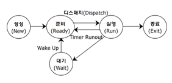

# 11과목 응용 SW 기초 기술 활용

## OSI 7계층★★★

#아(A)파(P)서(S) 티(T)내(Ne)다(Da) 피(Phy)나다

- 네트워크 통신에서 충돌 문제 최소화하고자, 국제표준화기구(ISO)에서 제시한 네트워크 통신 규약

### TCP/IP프로토콜의 구조

| OSI                                              | TCP/IP               | 기능                                                         |
| ------------------------------------------------ | -------------------- | ------------------------------------------------------------ |
| 응용 계층(A) 표현 계층(P) 세션 계층(S) | 응용 계층            | 응용 프로그램 간의 데이터 송, 수신 제공 #HTTP,FTP,TELNET,SMTP / SNTP, DNS (TCP를 사용하는 서비스 / UDP 사용 서비스) |
| 전송 계층(T)                                     | 전송 계층            | 호스트들 간의 신뢰성 있는 통신 제공 #TCP / UDP, RTCP    |
| 네트워크 계층(Ne)                                | 인터넷 계층          | 데이터 전송을 위한 주소 지정, 경로 설정(Routing) 제공 #IP, ICMP, IGMP, ARP, RARP, RIP, OSPF |
| 데이터 링크 계층(Da) 물리 계층(Phy)         | 네트워크 엑세스 계층 | 실제 데이터(프레임)를 송, 수신 하는 역할 # Ethernet, IEEE 802, HDLC, X 25, RS-232C, ARQ |

### 응용 계층 (Application Layer, 7 계층)

: 사용자와 네트워크 간 응용서비스 연결, 데이터 생성

- HTTP(Hypertext Transfer Protocol) - HTML 문서를 송수신하기 위한 표준 프로토콜
- FTP(File Transfer Protocol) - 파일 송수신 프로토콜
- TALNET - 원격지 컴퓨터에 접속하여 자신의 컴퓨터처럼 사용할 수 있도록 해주는 서버
- SNTP(Simple Network Management Protocol) - TCP/IP의 네트워크 관리 프로토콜
- DNS(Domain Name System) - 도메인 네임을 IP 주소로 매핑하는 시스템

전자 우편 프로토콜

- SMTP(Simple Mail Transter Protocol) : 이메일을 보내기 위한 프로토콜
- POP3(Post Office Protocol 3) : 이메일을 가져오기 위한 프로토콜 (로컬 PC 저장 후 불러옴)
- IMAP(Internet Messaging Access Protocol) : 이메일을 가져오기 위한 프로토콜(메일 서버에서 불러옴)
- MIME(Multipurpose Internel Mail Extensions) : 멀티미디어 메일 전송

### 표현 계층 (Presentation Layer, 6 계층)

: 데이터 형식 설정, 부호교환, 암복호화, 데이터 압축, 문맥 관리 기능

- JPEG : 이미지를 위한 표준 규격
- MPEG : 멀티미디어를 위한 표준 규격

### 세션 계층 (Session Layer, 5 계층)

: 연결 접속, 동기 제어, 송수신 간의 논리적인 연결

1. SSH(Secure Shell) : 보안 쉘, 높은 안전성을 보장하는 원격 접속 프로토콜 (22번 포트번호)
2. SSL/TLS : 보안 프로토콜
3. RPC : 원격 프로시저 호출
4. NetBIOS : 응용계층의 애플리케이션에 API 제공

### 전송 계층 (Transport Layer, 4계층)

: 신뢰성있는 통신 보장, 흐름 제어, 오류 제어, 혼잡 제어 (세그먼트)

1. TCP(Transmission Control Protocol)
   - 신뢰성 보장, 연결 지향적 특징, 흐름 제어, 혼잡 제어
2. UDP(User Datagram Protocol)
   - 비신뢰성, 순서화되지 않은 데이터그램 서비스 제공, 실시간 응용 및 멀티캐스트 가능
3. RTCP(Real-Time Control Protocol)
   - 패킷의 전송 품질을 제어하기 위한 제어 프로토콜

*UDP 관련 프로토콜*

4. SNMP(Simple Network Management Protocol)
   - 네트워크 장비를 관리 감시하기 위한 목적, UDP상에 정의된 응용 계층 표준 프로토콜
   - 네트워크 관리자가 네트워크 성능을 관리하고 네트워크 문제점을 찾는다.
5. RTP(Real Time Transport Protocol)
   - 실시간 특성을 가지는 데이터의 종단간 전송을 제공해주는 UDP 기반의 프로토콜
   - 실시간으로 음성이나 동영상을 수신하기 위한 전송 계층 프로토콜. UDP와 애플리케이션 사이에 위치함

### 네트워크 계층(Network Layer, 3 계층)

: 데이터를 목적지까지 가장 안전하고 빠르게 전달 (패킷)

1. IP(Internet Protocol) : 패킷 단위의 네트워크 통신 프로토콜
2. ICMP(Internet Control Message Protocol)
   - TCP/IP 에서 신뢰성 없는 IP를 대신해서 송신측으로 네트워크의 IP 상태 및 에러 메시지 전달
3. IGMP(Internet Group Management Protocol)
   - 멀티캐스트 실시간 전송을 위한 프로토콜
4. ARP(Address Resolution Protocol)
   - IP 주소 -> MAC 주소로 변환
5. RARP(Reverse Address Resolution Protocol)
   - MAC 주소 -> IP 주소로 변환
   - 물리 네트워크(MAC) 주소에 해당하는 IP 주소를 알려주는 프로토콜로 역순 주소 결정 프로토콜
6. 라우팅 프로토콜 (Routing Protocol) : 최적의 전송 경로를 찾는 프로토콜
   1. RIP(Routing Information)
      - 벨만 포드 알고리즘 사용 (거리 벡터 알고리즘 기초) / 홉카운트 15
   2. OSPF(Open Shortest Path First)
      - 다익스트라 알고리즘 사용 (링크 상태 알고리즘 기초) / 홉카운트 무제한
   3. BGP
      - 경로-벡터 알고리즘 사용 / ISP 사업자간 주로 사용

> IP 관련 용어
>
> - NAT(Network Address Translation) : 사설 IP 주소 -> 공인 IP 주소 변환하는 주소 변환기
> - DHCP(Dynamic Host Configuration Protocol) : 클라이언트의 IP 주소를 자동으로 동적 할당
> - CIDR(Classes Inter-Domain Routing) : Class 체계보다 유연한 IP 주소할당방식(클래스 없는 도메인간 라우팅 기법)

### 데이터 링크 계층(Data Link Layer, 2 계층)

: 물리계층을 통해 송수신되는 정보의 오류와 흐름을 관리하여 안전한 정보의 전달을 수행할 수 있도록 한다.

1. HDLC(High-level Data Link Control) : 비트 위주의 데이터 링크 제어 프로토콜
2. PPP(Point-to-Point Protocol) : 통신 노드 간 연결을 위한 프로토콜
3. 프레임 릴레이 : 프레임 간 중계기능 등을 통해 데이터 전송이 가능한 프로토콜
4. ATM : 고정크기 단위로 전송하는 비동기 전송 프로토콜

### 물리 계층(Physical Layer, 1 계층)

: 전송에 필요한 두 장치 간의 실제 접속과 절단 등 기계적, 전기적, 기능적, 절차적 특성에 대한 규칙 정의 (비트)

1. RS-232C : 공중 전화 교환망(PSTN)을 통한 DTE와 DCE 간의 인터페이스를 제공하는 프로토콜
2. X.21

## 프로토콜 ★★

- 심리학자 톰 마릴은 컴퓨터가 메시지를 전달하고 메시지가 제대로 도착했는데 확인하며 도착하지 않았을 경우 메시지를 재전송하는 일련의 방법을 '기술적 은어'를 뜻한다
- 이기종 시스템 간 데이터 교환을 할 수 있도록 하는 표준화 통신 규약

### 프로토콜 3가지 구성 요소

- 구문(Syntax) : 데이터의 형식이나 부호화 및 신호 레벨 등을 규정
- 의미(Semantics) : 전송의 조작이나 오류 제어를 위한 제어 정보에 대한 규정
- 타이밍(Timing) : 접속되어 있는 개체 간의 통신 속도의 조정이나 메세지의 순서 제어 등을 규정

> TKIP (Temporal Key Integrity Protocol) : 임시 키 무결성 프로토콜

## IP★★

### IPv4(Internet Protocol Address)

- 길이 32 비트로 구성되며, 8 비트씩 네 부분으로 나눈다.

### IP 주소의 분류

- A Class : (0.0.0.0 ~ 127.255.255.255) (국가나 대형 통신망)
- B Class : (128.0.0.0 ~ 191.255.255.255) (중대형 통신망)
- C Class : (192.0.0.0 ~ 223.255.255.255)(소규모 통신망)
- D Class ; (224.0.0.0 ~ 239.255.255.255.)(멀티 캐스트용)
- E Class : (240.0.0.0 ~ 255.255.255.255)(연구용. 실험적 주소이며 공용되지 않음)

### 서브네팅(Subatting)

- 할당된 네트워크 주소를 다시 여러 개의 작은 네트워크로 나누어 사용
- 서브넷 마스크(Subnet Mask) : 4 바이트의 IP 주소 중 네트워크 주소와 호스트 주소를 구분하기 위한 비트로, 이를 변경해 네트워크 주소를 여러 개로 분할해 사용

### IPv6(Internet Protocol version 6)

- 128비트 길이를 가진다.
- 현재 IPv4의 확장형으로 IPv4 가 가지고 있는 주소 고갈, 보안성, 이동성 지원 등의 문제점을 해결하기 위해서 개발된 128 비트 주소체계를 갖는 차세대 인터넷 프로콜
- IPv6 주소 예시 : 1050:0:0:0:5:600:300c:326b

### IPv4에서 IPv6으로 전환 방법 : 듀얼 스택, 터널링, 주소 변환

- 듀얼 스택 : IP 계층에 IPv4, IPv6 프로토콜을 모두 탑재하여 전송 상대에 따라 선택
- 터널링 : 인접한 IP 망에 터널을 만들고 캡슐화하여 전송
- 주소변환 : 게이트웨이(주소변화기)로 패킷 변환

### 주소체계

- IPv4 : 유니캐스트, 멀티캐스트, 브로드캐스트
- IPv6 : 유니캐스트, 멀티캐스트, 애니캐스트

- 유니 캐스트 : 단 하나의 수신자에게 1 대 1로 정보를 전송
- 멀티캐스트 : 같은 내용의 데이터를 여러 명의 특정한 일부 그룹의 수신자들에게 동시에 전송
- 브로드캐스트 : 하나의 송신자가 같은 서브네트워크 상의 모든 수신자에게 데이터 전송
- 애니캐스트 : Topology 상의 수신자 그룹 안에서 가장 가까운 노드로 데이터그램을 연결시키는 프로토콜

## 프로세스, PCB

- 프로시저가 활동중인 것, 비동기적 행위를 일으키는 주체, 운영체제가 관리하는 실행 단위, 실행중인 프로그램
- PCB(Process Control Block)을 가진 프로그램, 실기억장치에 저장된 프로그램
- 프로세서가 할당되는 실체로서, 디스패치가 가능한 단위

### 프로세스 상태 전이

1. 디스패치(Dispatch) : 준비 -> 실행
2. 할당시간초과(Time Run Out)  : 실행 -> 준비
3. 대기(Block) : 실행 -> 대기
4. 웨이크업(Wake Up) : 대기 -> 준비

### 문맥 교환 (Context Switching)

- 하나의 프로세스에서 다른 프로세스로 CPU가 할당되는 과정에서 발생
- 이전 프로세스의 상태 레지스터 내용을 보관하고 다른 프로세스의 레지스터를 적재하는 과정
- CPU가 실행중인 프로세스의 상태를 PCD에 저장, 다음 프로세스의 PCB로부터 문맥 복원

### MMU(Memory Management Unit)

: 가상 메모리를 실제 메모리 주소로 변환해주는 장치

### 스풀링 (Spooling)

: 나중에 한꺼번에 입출력하기 위해 디스크에 저장하는 과정

### PCB(Process Control Block, 프로세스 제어 블록)

- 프로세스 식별자, 프로세스 상태 등의 정보로 구성
- 프로세스에 대한 정보를 저장해 놓은곳

### 스레드(Thread)

- 프로세스의 실행단위
- 커널 스레드 : 운영체제 커널에 의해 스레드 운용, 구현이 쉬우나 속도 느림
- 사용자 스레드 : 사용자가 만든 라이브러리를 사용해 스레드 운용, 속도가 빠르나 구현 어렵다.

## 패킷 교환 방식

- 전송할 전체 데이터를 일정 크기로 나누어 패킷 교환망 내의 패킷 교환기에 일시적으로 축적되었다가 전송
- HTTP가 대표적인 패킷 교환 방식에 해당

1. 가상 회선 방식 : 목적지 호스트와 미리 연결한 후, 통신하는 연결형 교환 방식
2. 데이터그램 방식 : 헤더에 붙어서 개별적으로 전달하는 비연결형 교환 방식

## UNIX

- 계층 구조(트리 구조)의 파일 시스템
- 이식성이 높으며 장치 간의 호환성이 높다.
- 다중 사용자(Multi-User), 다중 작업(Multi-tasking) 지원
- 시분할 시스템(Time Sharing System)을 위해 설계된 대화식 운영체제
- 하드웨어 > 커널(Kernel) > 쉘(Shell) > 유틸리티(Utility) > 사용자(User)
- 데니스 리치와 켐톤슨 등이 함께 벨 연구소를 통해 만든 운영체제이며, 90% 이상 C 언어로 구현되어 있고, 시스템 프로그램이 모듈화되어 있어서 다른 하드웨어 기종으로 쉽게 이식 가능하며 계층적 트리 구조를 가짐으로써 통합적인 파일 관리가 용이한 운영체제

### 커널(Kernel)

- 프로세스, 기억장치, 입출력 관리를 수행
- 컴퓨터가 부팅될 때 주기억장치에 적재된 후 상주하면서 실행
- 하드웨어를 보호하고 프로그램과 하드웨어 간의 인터페이스 역할을 담당

Bootstrapping : 운영체제의 커널(Kernel)을 찾아 메모리에 적재하는 과정

### 쉘(Shell)

- 명령어 해석기
- 시스템과 사용자 간의 인터페이스를 담당
- 주기억장치에 상주하지 않고, 명령어가 포함된 파일 형태로 존재하며 보조기억장치에서 교체 처리가 가능

### UNIX 명령어

- fork : UNIX 에서 새로운 프로세스를 생성하는 명령어
- uname : 운영체제 분석을 위해 리눅스에서 버전을 확인하고자 할 때 사용되는 명령어
- cat : 파일 내용 화면 표시, 커널 버전 확인
- chdir : 현재 사용할 디렉터리의 위치 변경
- chown : 소유자 변경, change own
- cp : 파일 복사, copy
- rm : 파일 삭제 remove
- exec : 새로운 프로세스 수행, execute
- find : 파일 찾기
- fsck : 파일 시스템 검사 및 보수, filesystem check
- mount/unmount : 파일 시스템 마운팅/ 마운팅 해제

### 유틸리티(Utilitiy)

- 문서 편집, 데이터베이스 관리, 언어 번역, 네트워크 기능을 제공

### UNIX 에서의 프로세스 간 통신

- 각 프로세스는 시스템 호출을 통해 커널의 기능을 사용하며, 프로세스 간 통신은 시그널(Signal), 파이프(Pipe), 소켓(Socket)을 사용
- 시그널(Signal) : 간단한 메시지를 이용하여 통신하는 것, 초기 UNIX 시스템에서 사용
- 파이프(Pipe) : 한 프로세스의 출력이 다른 프로세스의 입력으로 사용되는 단방향 통신 방식
- 소켓(Socket) : 프로세스 사이의 대화를 가능하게 하는 쌍방향 통신 방식

### 소켓(Socket)

: 통신을 위한 프로그램을 생성하여 포트를 할당하고, 클라이언트의 통신 요청 시 클라이언트와 연결하는 내외부 송수신 연계기술

## 운영체제

- 사용자와 하드웨어 간의 인터페이스를 담당하는 소프트웨어

### 운영체제 현행 시스템 분석
  : 품질 측면 (신뢰도, 성능), 지원 측면 (기술 지원, 주변 기기, 구축 비용)

### 운영 체제를 기능에 따라 분류할 경우 제어 프로그램

- 데이터 관리 프로그램 : 주/보조기억장치 사이의 데이터 전송, 파일과 데이터를 처리 유지 보수 기능 수행
- 작업 제어 프로그램 : 작업의 연속 처리를 위한 스케줄 및 시스템 자원 할당 등을 담당
- 감시 프로그램 : 프로그램과 시스템 작동상태를 감시 감독

### 운영체제의 목적

- 처리 능력(Throughput) 향상 : 일정 시간 내의 시스템이 처리하는 일의 양
- 반환 시간(Turn Around Time) 단축 : 시스템에 작업을 의뢰한 시간부터 처리가 완료될 때까지 걸린 시간
- 신뢰도(Reliability) : 시스템이 주어진 문제를 정확하게 해결하는 정도
- 가용성(Availability) : 시스템을 사용할 필요가 있을 때 즉시 사용 가능한 정도

- 안드로이드 : 리눅스 커널을 기반으로 동작하며 자바의 코틀린 언어로 개발된, 모바일 기기에 주로 사용되는 오픈 소스 플랫폼인 운영체제
- Linux : Uni 기반의 오픈 소스 운영 체제
- Android : Linux 기반의 휴대용 장치를 위한 운영체제
- Mac OS :  Unix 기반의 GUI 운영 체제

## 스케쥴링

1. 장기 스케줄링(작업 스케줄링, 상위 스케줄링)
   - 어떤 프로세스가 시스템의 자원을 차지할 수 있도록 할 것인가를 결정하여 준비상태 큐로 보내는 작업
   - 작업 스케줄러에 의해 수행됨
2. 중기 스케줄링
   - 어떤 프로세스들이 CPU를 할당받을 것인지 결정하는 작업
3. 단기 스케줄링 (프로세서 스케줄링, 하위 스케줄링)
   - 프로세스가 실행되기 위해 CPU를 할당받는 시기와 특정 프로세스를 지정하는 작업
   - 프로세서 스케줄링 및 문맥 교환은 프로세서 스케줄러에 의해 수행

### 프로세스 스케줄링 기법

- 선점(Preemptive) 스케줄링
  - 하나의 프로세스가 CPU를 할당받아 실행하고 있을 때 우선순위가 높은 다른 프로세스가 CPU를 강제로 빼앗아 선점할 수 있는 기법
  - 빠른 응답 시간을 요구하는 대화식 시분할 시스템(Time Sharing System)에 사용
  - 많은 오버헤드 발생

1. RR (Round-Robin)

   - 시간 할당이 작아지면 프로세스-문맥 교환이 자주 일어난다.

   - Time Sharing System을 위해 고안된 방식

   - 동일한 Time Slice를 사용하는 시분할 처리 시스템에 효과적

2. SRT (Shortest Remaining Time)

   - SRT는 실행 시간을 추적해야 하므로, 오버헤드가 증가

   - 작업이 끝나지 않은 프로세스의 남아 있는 실행시간이 가장 작은 프로세스를 먼저 실행하는 방식 SJF 기법을 선점 형태로 변경한 것. 점유 시간이 길어도 중요한 프로세스를 먼저 할당할 수 있음

3. MFQ (Multilevel Feedback Queue)
   - 짧은 작업이나 입출력 위주의 프로세스에 우선운위를 부여하기 위해 개발된 방식
   - 우선순위가 있는 각 큐(대기 리스트)가 있으며 큐 마다 Time Slice 가 존재함. 맨 마지막 단계의 큐는 RR 스케줄링 방식을 사용

- 비선점(Non-Preemptive) 스케줄링
  - 이미 할당된 CPU 를 다른 프로세스가 강제로 빼앗아 선점 할 수 없는 기법
  - 모든 프로세스에 대한 요구를 공정하게 처리 가능
  - 일괄 처리 방식에 적합
  - 우선순위(Priority), 기한부(Deadline), FCFS(FIFO), SJF, HRN

1. SJF (Shortest Job First)
   - 실행 시간이 가장 짧은 프로세스 순으로 처리
2. HRN (Highest Response-ratio Next)
   - SJF 기법을 보완하기 위한 방식
   - 대기 시간이 긴 프로세스의 경우 우선 순위가 높아진다.
   - 우선 순위를 계산하여 그 수치가 가장 높은 것부터 낮은 순으로 우선 순위가 부여
   - HRN 우선순위 계산식 : (대기시간 + 서비스시간) / 서비스시간

## 기억장치 관리 기법

1. 반입(Fetch) 전략 : 메모리 적재 시기 결정(When)
   - 보조기억장치에 보관중인 프로그램이나 데이터를 언제(When) 주기억장치로 적재할 것인지를 결정하는 전략
   - 요구 반입(Demand Fetch) : 실행중인 프로그램이 특정 프로그램이나 데이터 등의 참조를 요구할 때 적재
   - 예상 반입(Anticipatory Fetch) : 실행중인 프로그램에 의해 참조될 프로그램이나 데이터를 미리 예상하여 적재
2. 배치(Placement) 전략 : 메모리 적재 위치 결정 (Where)
   - 새로 반입되는 프로그램이나 데이터를 주기억장치의 어디에(Where) 위치시킬 것인지를 결정하는 전략
   - 최초 적합(First Fit) : 빈 영역 중에서 첫 번째 분할 영역에 배치
   - 최적 적합(Best Fit) : 빈 영역 중에서 단편화를 가장 적게 남기는 분할 영역에 배치
   - 최악 적합(Worst Fit) : 빈 영역 중에서 단편화를 가장 많이 남기는 분할 영역에 배치
3. 교체(Replacement) 전략 : 메모리 교체 대상 결정(Who)
   - 이미 사용되고 있는 영역 중에서 어느(Who) 영역을 교체할지 결정하는 전략
   - FIFO, LRU, LFU, NUR, OPT, SCR

- 페이지 교체 알고리즘
  - FIFO(First In First Out) = FCFS(First Come First Serve)
    - 각 페이지가 주기억장치에 적재될 때마다 그때의 시간을 기억시켜 가장 먼저 들어와서 가장 오래 있었던 페이지를 교체하는 기법 
  - LRU(Least Recently Used)
    - 최근에 가장 오랫동안 사용하지 않은 페이지를 교체하는 기법
    - 가장 오래 전에 사용된 페이지 교체
  - LFU(Least Frequently Used)
    - 사용 빈도가 가장 적은 페이지를 교체하는 기법
  - OPT(OPTmal replacement, 최적 교체)
    - 앞으로 가장 오랫동안 사용하지 않을 페이지를 교체하는 기법
  - NUR(Not Used Recently)
    - LRU와 비슷한 알고리즘으로, 최근에 사용하지 않은 페이지를 교체하는 기법
    - 각 페이지마다 두 개의 비트, 즉 참조 비트와 변형 비트 사용
  - SCR(Second Chance Replacement, 2차 기회 교체)
  - FIFO 기법의 단점을 보완하는 기법
- 주기억장치 할당(Allocation) : 메모리 적재 방법 결정(How)
  - 프로그램이나 데이터를 실행시키기 위해 주 기억장치에 어떻게(how) 할당할지 정함
  - 연속 할당 기법 : 프로그램을 주기억장치에 연속으로 할당하는 기법
    - 단일 분할 할당 기법 : 오버레이, 스와핑
    - 다중 분할 할당 기법 : 고정(정적) 분할 할당 기법, 가변(동적) 분할 할당 기법
  - 분할 할당 기법 : 프로그램을 특정 단위의 조각으로 나누어 할당하는 기법
    - 페이징(Paging) 기법 / 세그먼테이션(Segmentation) 기법 

### 가상기억장치

- 보조기억장치(하드디스크)의 일부를 주기억장치로 사용하는 것으로, 용량이 작은 주 기억장치를 마치 큰 용량을 가진 것처럼 사용하는 기법
- 주기억장치의 용량보다 큰 프로그램을 실행하기 위해 사용
- 블록 단위로 나누어 사용하므로 연속 할당 방식의 단편화 해결 가능

### 단편화(Fragmentation)

- 분할된 주기억장치에 프로그램을 할당하고 반납하는 과정을 반복하면서 사용되지 않고 남는 기억장치의 빈공간 조각을 의미. 내부단편화와 외부단편화가 있음

## RAID

### RAID(Redundant Array of Independent Dist), 복수 배열 독립 리스크

= 디스크 어레이 (dist array)

- 여러 개의 하드디스크로 디스크 배열을 구성하여 파일을 구성하고 있는 데이터 블록들을 서로 다른 디스크들에 분산 저장해 디스크의 속도 향상
- 여러개의 디스크를 묶어 하나의 디스크처럼 사용하는 기술
- 레벨 : RAID0, RAID1,RAID1E,RAID10,RAID5,RAID50,RAID6,RAID60,RAID2,RAID3,RAID4

## 페이징, 세그먼테이션

### 페이징(Paging) 기법

- 가상기억장치에 보관되어 있는 프로그램과 주기억장치의 영역을 동일한 크기로 나눈 후 나눠진 프로그램(페이지)을 동일하게 나눠진 주기억장치의 영역(페이지 프레임)에 적재시켜 실행하는 기법
- 외부 단편화는 발생하지 않으나, 내부 단편화 발생

### 세그먼테이션(Segmentation) 기법

- 가상기억장치에 보관되어 있는 프로그램을 가변적인 크기의 논리적인 단위로 나눈 후 주기억장치에 적재시켜 기억공간을 절약하기 위해서 사용하는 실행시키는 방법
- 내부 단편화는 발생하지 않으나, 외부 단편화 발생

### 워킹 셋(Working Set)

- 운영체제의 가상기억장치 관리에서 프로세스가 일정 시간동안 자주 참조하는 페이지들의 집합을 의미
- 프로세스가 일정 시간 동안 자주 참조하는 페이지들의 집합

### 스레싱(Thrashing)

- 프로세스의 처리 시간보다 페이지 교체에 소요되는 시간이 더 많아지는 현상

### 페이지 부재 빈도(PFF; Page Fault Frequency) 방식

- 페이지 부재율에 따라 주기억장치에 있는 페이지 프레임의 수를 늘리거나 줄여 페이지 부재율을 적정 수준으로 유지하는 방식. 페이지 부재가 일어나는 횟수를 의미
- 페이지 부재(Page Fault) : 프로세스 실행 시 참조할 페이지가 주 기억장치에 없는 현상

### 프리페이징(Prepaging)

- 처음의 과도한 페이지 부재를 방지하기 위해 필요할 것 같은 모든 페이지를 미리 한꺼번에 페이지 프레임에 적재하는 기법
- 기억장치에 들어온 페이지들 중에서 사용되지 않는 페이지가 많을 수 도 있음

### 파일 구조(File Structures)

- 파일구조는 파일을 구성하는 레코드들이 보조기억장치에 편성되는 방식으로 접근 방식에 따라 방식이 달라진다. 접근 방법중, 레코드들을 키-값 순으로 정렬하여 기록하고, 레코드의 키 항목만을 모은 (인덱스)을 구성하여 편성하는 방식이 있으며, 레코드를 참조할 때는 (인덱스)이 가르키는 주소를 사용하여 직접 참조할 수 있다. 파일 구조에는 순차접근, (인덱스) 접근, 해싱 접근이 있다.

## 가상화(Virtualization)

- 물리적인 리소스들을 사용자에게 하나로 보이게 하거나, 하나의 물리적인 리소스를 여러개로 보이게 하는 기술

### 클라우드 컴퓨팅(Cloud computing)

- 인터넷을 통해 가상화된 컴퓨터 시스템 리소스 제공

### 클라우드 컴퓨팅 유형

- 인프라형 서비스(IaaS) : 서버, 스토리지 같은 시스템 자원(HW)을 클라우드로 제공하는 서비스
- 플랫폼형 서비스(PaaS) : 애플리케이션 개발, 실행, 관리할 수 있게하는 플랫폼을 제공하는 서비스
- 소프트웨어형 서비스(SaaS) : 클라이언트를 통해 접속하여 소프트웨어 서비스 형태로 이용하는 서비스

### PaaS-TA

- 국내 IT 서비스 경쟁력 강화를 목표로 개발되었으며 인프라 제어 및 관리 환경, 실행 환경, 개발 환경, 서비스 환경, 운영환경으로 구성되어 있는 개방형 클라우드 컴퓨팅 플랫폼

## 교착상태(Deadlock)

### 교착상태가 발생할 수 있는 조건

- 상호 배제(Mutual exclusion) : 한 리소스는 한 번에 한 프로세스만 사용할 수 있음
- 점유와 대기(Hold and wait) : 어떤 프로세스가 하나 이상의 리소스를 점유하고 있으면서 다른 프로세스가 가지고 있는 리소스를 기다린다.

- 비선점(Non-preemption) : 프로세스가 작업을 마친 후 리소스를 자발적으로 반환할 때 까지 기다린다.
- 환형 대기(Circular wait) : 각 프로세스는 순환적으로 다음 프로세스가 요구하는 자원을 가진다.

### 교착상태의 해결 기법

1. Detection(탐지)
   - 교착상태 발생을 허용하고 발생 시 원인을 규명하여 해결
   - ex. 자원할당 그래프
2. Recovery(복구)
   - 교착상태 발견 후 현황대기를 배제시키거나 자원을 중단하는 메모리 할당 기법
   - ex. 선점, 프로세스 중지(희생자 선택)

3. Avoidance(회피)
   - 교착상태 가능성을 배제하지 않고 적절하게 피해나가는 방법
   - ex. 은행원 알고리즘(Banker's Algorithm)

4. Prevention(예방)
   - 교착상태의 필요조건(4개 조건)을 부정함으로써 교착상태가 발생하지 않도록 미리 예방하는 방법
   - 교착 상태의 원인이 되는 조건 중 하나를 제거
   - 일반적으로 자원의 낭비가 가장 심함

### 모니터(Monitor)

- 병행프로세스의 문제점을 해결하기 위한 방안 중 상호배제의 한 형태인 동기화기법 중 하나
- 세마포어, 모니터 중 하나

## 시간지역성, 공간 지역성

### 시간 지역성(Temporal Locality)

- 하나의 기억장소가 가까운 장래에도 참조될 가능성이 높다.

- #Loop(루프),Stack(스택),Subroutine(서브루틴),Counting(카운팅), Totaling(집계)

### 공간 지역성(Spatial Locality)

- 어느 하나의 페이지를 참조하면 그 근처의 페이지를 계속 참조할 가능성이 높음
- #Array(배열),Sequential Code(순차적 코드)

## 트래픽 제어

### 트래픽 제어 (Traffic Control)

- 네트워크의 보호, 성능유지, 자원의 효율적인 이용을 위해 전송되는 패킷의 흐름이나 양을 조절하는 기능

1. 흐름 제어(Flow Control) : 송수신 측 사이에 전송되는 패킷의 수를 제어

   - 정지 및 대기(Stop and Wait)

     - TCP 흐름제어기법 중 프레임이 손실되었을 때, 손실된 프레임 1개를 전송하고 수신자의 응답을 기다리는 방식으로 한 번에 프레임 1 개만 전송할 수 있는 기법
     - 수신 측의 확인 신호(ACK)를 받은 후에 다음 패킷을 전송하는 방식 -> 한번에 하나의 패킷 전송

   - 슬라이딩 윈도우(Sliding Window)

     - 수신 측의 확인 신호(ACK)를 받지 않더라도 미리 정해진 패킷의 수만큼 연속적으로 전송하는 방식

       - 한번에 여러 개 패킷 전송

     - 수신 측으로부터 송신한 패킷에 대한 긍정 수신 응답(ACK)이 전달된 경우 윈도우 크기는 증가하고, 수신측으로부터 부정 수신 응답(NAK)이 전달된 경우 윈도우 크기는 감소

     - 한 번에 여러 패킷(프레임)을 전송할 수 있어 전송 효율이 좋은 기법

     - 수신 측으로부터 이전에 송신한 패킷에 대한 긍정 수신 응답(ACK)이 전달된 경우 윈도우 크기는 증가,

       수신 측으로부터 이전에 송신한 패킷에 대한 부정 수신 응담(NAK)이 전달된 경우 윈도우 크기는 감소

2. 폭주(혼잡) 제어(Congestion Control) : 네트워크 내의 패킷 수를 조절하여 네트워크 오버플로를 방지

   - 느린 시작(Slow Start)
     - 윈도우의 크기를 1, 2, 4, 8 ... 같이 2 배씩 지수적으로 증가시켜 초기에는 느리지만 갈수록 빨라짐
     - 전송 데이터의 크기가 임계 값에 도달하면 혼잡 회피 단계로 넘어감
     - 패킷이 문제없이 도착하면 혼잡 윈도우 크기를 패킷마다 1 씩 증가시켜 한 주기가 지나면 혼잡 윈도우 크기가 2 배로 되지만, 혼잡 현상 발생시 혼잡 윈도우 크기를 1 로 줄여버리는 방식
   - 혼잡 회피(Congestion Avoidance)
     - 느린 시작의 지수적 증가가 임계 값에 도달하면 혼잡으로 간주하고 회피를 위해 윈도우의 크기를 1 씩 선형적으로 증가시켜 혼잡을 예방하는 방식
     - 네트워크 내에서 패킷의 지연이 너무 높아지게 되어 트래픽이 붕괴되지 않도록 패킷의 흐름을 제어하는 트래픽 제어(종류 : AMID, Slow Start)

3. 교착 상태(Dead Lock) 방지

   - 교환기 내에 패킷을 축적하는 기억 공간이 꽉 차 있을 때 다음 패킷들이 기억 공간에 들어가기 위해 무한정 기다리는 현상

