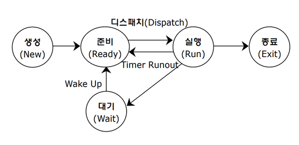

# 4과목 프로그래밍 언어 활용 4~23

## 4. 배치 프로그램

- 배치 프로그램(Batch Program)의 개요
  - 일괄적으로 처리
  - 이벤트성 배치
  - On-Demand 배치
  - 정기 배치
  - 필수 요소
    - 대용량 데이터
    - 자동화
    - 견고성
    - 안정성/신뢰성
    - 성능
- 배치 스케줄러, 잡 스케줄러
  - 일괄 처리 작업이 설정된 주기에 맞춰 자동으로 수행되도록 지원해주는 도구
  - 스프링 배치 :  Step
  - 쿼즈 : Trigger, Scheduler

## 5. 패키지 소프트웨어

- 패키지 소프트웨어의 개요

  - |                        | **패키지 소프트웨어**                 | **전용 개발  소프트웨어**                   |
    | ---------------------- | ------------------------------------- | ------------------------------------------- |
    | **기능**  **요구사항** | 70% 이상 충족시키는 패키지 소프트웨어 | 모든 기능 요구사항 반영 가능                |
    | **안정성**             | 품질이 검증됐고, 업계 표준  준용      | 개발자의 역량에 따라 달라짐                 |
    | **라이선스**           | 판매자                                | 회사                                        |
    | **생산성**             | 개발을 위한 인력과 시간 절약 가능     | 개발을 위한 인력과 시간 필요                |
    | **호환성**             | 보장 안됨                             | 설계 단계부터 고려하며 개발해서 호환성 좋음 |
    | **유지보수**           | 결함 발생 시 즉시 대응 어려움         | 결함 발생 시 즉시 대응 가능                 |

## 6. 데이터 타입

- 불린 : 조건의 참, 거짓 여부
- 문자(char) : 한 문자, 작은따옴표(')
- 문자열(String) : 문자열, 큰따옴표(")
- 정수(int) : 정수
- 부동 소수점 타입(float) : 실수
- 배열 타입(array) : 데이터 집합
- C/C++ 데이터 타입 크기

| **종류**                  | **데이터 타입**          | **크기** |
| ------------------------- | ------------------------ | -------- |
| **문자**/부호없는  문자형 | **char**/unsigned char   | 1Byte    |
| **정수**/부호없는  정수형 | **short**/unsigned short | 2Byte    |
| **int**/unsigned int      | 4Byte                    |          |
| **long**/unsigned long    | 4Byte                    |          |
| **long long**             | 8Byte                    |          |
| **실수**                  | **float**                | 4Byte    |
| **double**                | 8Byte                    |          |
| **long double**           | 8Byte                    |          |

## 7. 변수

- 변수의 개요
  - 발생하는 값을 저장하기 위한 공간, 변할 수 있는 값
- 변수명 작성 규칙
  - 영문자, 숫자, _ 사용가능
  - 첫글자 숫자는 올수 없음
  - 대, 소문자 구분
  - 공백, 특수문자를 사용할 수 없음
  - 예약어을 변수명으로 사용할 수 없음
  - 문장 끝 세미콜론
- 예약어 - C 언어

| **구분**    | **예약어**                                                   |                |
| ----------- | ------------------------------------------------------------ | -------------- |
| 제어문      | 반복                                                         | do, for, while |
| 선택        | case, default, else, if, switch                              |                |
| 분기        | break, continue, goto, return                                |                |
| 자료형      | char, short, int, long, float,  double, enum, signed, unsigned, union, void, struct, typedef |                |
| 기억 클래스 | auto, register,  static, extern                              |                |
| 기타        | const, sizeof, volatile                                      |                |

- 기억 클래스

  - 기억영역을 결정하는 작업

  - 

  - | **종류**            | **기억영역**   | **예약어** | **생존기간** | **사용 범위** |
    | ------------------- | -------------- | ---------- | ------------ | ------------- |
    | **자**동 변수       | 메모리(스택)   | auto       | 일시적       | 지역적        |
    | **레**지스터 변수   | 레지스터       | register   |              |               |
    | **정**적 변수(내부) | 메모리(데이터) | static     | 영구적       |               |
    | 정적 변수(외부)     | 전역적         |            |              |               |
    | **외**부 변수       | extern         |            |              |               |

- 변수의 선언

**5)** **변수의 선언**

| **선언**            | **설명**                                                     |
| ------------------- | ------------------------------------------------------------ |
| 자료형 변수명 = 값; | ▶ **자료형**: 변수에 저장될 자료의 형식 지정  ▶ **변수명**: 사용자가 원하는 이름을 임의로 지정 (변수명 작성 규칙 준수)  ▶ **값**:  변수를 선언하면서 초기화할 값을 지정 |

## 8. 연산자

- 산술 연산자

| **연산자** | **의미**                                                     |
| ---------- | ------------------------------------------------------------ |
| +          | 덧셈                                                         |
| -          | 뺄셈                                                         |
| *          | 곱하기                                                       |
| **         | 제곱                                                         |
| /          | 나누기                                                       |
| //         | 나누기 연산 후 소수점 이하의 수를 버리고, 정수 부분의 몫을 구함 |
| %          | 나누기 연산 후 몫이 아닌 나머지를 구함                       |
| ++         | 증감 연산자 (전치; 먼저 변수의 값을 증감시킨 후 연산에 사용) |
| --         | 감소 연산자 (후치; 먼저 변수를 연산에 사용한 후 값을 증감시킴) |

- 시프트 연산자

| **연산자** | **의미**      | **비고**                                  |
| ---------- | ------------- | ----------------------------------------- |
| <<         | 왼쪽 시프트   | 비트를 왼쪽으로 이동  ex) 00101 → 01010   |
| >>         | 오른쪽 시프트 | 비트를 오른쪽으로 이동  ex) 00101 → 00010 |

- 관계 연산자

| **연산자** | **의미**    |
| ---------- | ----------- |
| ==         | 같다        |
| !=         | 같지 않다   |
| >          | 크다        |
| >=         | 크거나 같다 |
| <          | 작다        |
| <=         | 작거나 같다 |

- 비트 연산자

\- 비트별(0, 1)로 연산해 결과를 얻는 연산자

| **연산자** | **의미** | **비고**                                 |
| ---------- | -------- | ---------------------------------------- |
| &          | and      | 모든 비트가 1일 때만 1                   |
| \|         | or       | 모든 비트 중 한 비트라도 1이면 1         |
| ^          | xor      | 모든 비트가 같으면 0, 하나라도  다르면 1 |
| ~          | not      | 각 비트의 부정, 0이면 1, 1이면 0         |

- 논리 연산자

\- 두 개의 논리 값을 연산하여 참(true, 1) 또는 거짓(false, 0)을 결과로 얻는 연산자

| **연산자** | **의미** | **비고**                 |
| ---------- | -------- | ------------------------ |
| &&         | and      | 모두 참(1)이면 참(1)     |
| \|\|       | or       | 하나라도 참(1)이면 참(1) |
| !          | not      | 부정                     |

- 조건 연산자(삼항 연산자)

/ **if(?),** **else(:)**

\# 조건 수식 **?** 수식1 **:** 수식2;

- 대입 연산자

| **연산자** | **예**  | **의미** |
| ---------- | ------- | -------- |
| +=         | a += 1  | a = a+1  |
| -=         | a -= 1  | a = a-1  |
| *=         | a *= 1  | a = a*1  |
| /=         | a /= 1  | a = a/1  |
| %=         | a %= 1  | a = a%1  |
| <<=        | a <<= 1 | a = a<<1 |
| >>=        | a >>= 1 | a = a>>1 |

- 기타 연산자

| **연산자**    | **의미**                                                     |
| ------------- | ------------------------------------------------------------ |
| sizeof        | 자료형의 크기 표시                                           |
| ,(콤마 comma) | 왼쪽에서 오른쪽으로 순서대로 수행되며,  순서를 콤마로 구분  **순**서 연산자 |
| (자료형)      | 사용자가 자료형을 다른 자료형으로 변환할 때 사용하는 것  **캐스트(cast) 연산자**  ex) a = (int)1.3 + (int)1.4;  → a = 2 |

- 연산자 우선순위

| 단항 연산자       | 단항 연산자     | !(논리 not)  ~(비트 not)   ++  --  sizeof | ←    | **높음**  ↑                                      ↓  **낮음** |
| ----------------- | --------------- | ----------------------------------------- | ---- | ------------------------------------------------------------ |
| 이항 연산자       | **산**술 연산자 | *  /  %                                   | →    |                                                              |
| +  -              |                 |                                           |      |                                                              |
| **시**프트 연산자 | <<  >>          |                                           |      |                                                              |
| **관**계 연산자   | <  <=  >=  >    |                                           |      |                                                              |
| ==  !=            |                 |                                           |      |                                                              |
| **비**트 연산자   | &  ^  \|        |                                           |      |                                                              |
| **논**리 연산자   | &&  \|\|        |                                           |      |                                                              |
| 삼항 연산자       | **조**건 연산자 | ? :                                       | →    |                                                              |
| 대입 연산자       | **대**입 연산자 | = += -= *= /= %= <<= >>=                  | ←    |                                                              |
| 순서 연산자       | **순**서 연산자 | ,                                         | →    |                                                              |

## 9. 제어문, 반복문

- 제어문의 개념
  - 무조건 위에서 아래로 실행, 프로그램의 순서를 변경할 때 사용하는 명령문
- 단순 if 문
  - 형식 1: 조건이 참일 때만 실행
  - 형식 2: 조건이 참일때와 거짓일 때 실행할 문장이 다름
- 다중 if 문
  - 형식 1: 조건이 여러 개
  - 형식 2: if문 안에 if 문

- switch문
  - 분기할 곳이 여러 곳

switch(수식)

 {

 case 레이블1:

​    실행할 문장1;  // 수식의 결과가 레이블 1과 일치할 때 실행

​    break;       // switch문 종료함

case 레이블 2:

​    실행할 문장2;  // 수식의 결과가 레이블 2와 일치할 때 실행

​    break;       // switch문 종료함

…

  default:       // 수식의 결과가 레이블 1~2와 일치하지 않을 때,

​    실행할 문장3;    혹은 break가 없을 땐 무조건 default 실행

 }

 

**ex)** 

 { case 3: printf(“1”);   // 수식의 결과(2)가 레이블 1(3)과 일치하지 않음

​    break;       

case 2: printf(“2”);   // 수식의 결과(2)가 레이블 2(2)와 일치함 → printf(“2”); 실행

​    break;       // switch문 종료함

  case 1: printf(“3”);   // 수식의 결과(2)가 레이블 3(1)과 일치하지 않음

​    break; 

 }           → 결과 2 표시됨

- 반복무의 개념
  - 일정한 횟수를 반복하는 명령문
- for문
  - 조건이 참이면 실행할 문장을 실행, 증가값 만큼 증가, 최종값에 대한 조건이 참인 동안 실행할 문장을 반복 수행

 for(초기값; 최종값; 증가값)

​          실행할 문장;    // 최종값이 참인 동안 실행, 두 문장 이상 → { } 입력

- while 문
  - 조건이 참인 동안 실행할 문장을 반복 수행
  - 조건이 처음부터 거짓이면 한 번도 실행하지 않음

while(조건)

​          실행할 문장;    // 조건이 참인 동안 실행, 두 문장 이상 → { } 입력

- do ~ while 문
  - 조건이 처음부터 거짓이어도 실행할 문장을 무조건 한 번 실행

 do

​    실행할 문장;  // 조건이 참인 동안 실행, 두 문장 이상 → { } 입력

while(조건);

- break, continue
  - switch 문이나 반복문의 실행을 제어
  - break
    - 블록을 벗어남
  - continue
    - 제어를 반복문의 처음으로 옮김

## 10. 배열과 문자열

- 배열의 개념
  - 동일한 데이터 유형을 여러 개 사용
  - 첨자
  - 대괄호 []
  - 배열의 위치는 0부터 시작
- 1차원 배열 선언 :자료형 변수명[개수];
  - 자료형 : 배열에 저장할 자료의 형
  - 변수명 : 사용할 배열의 이름
  - 개수 : 크기 지정, 생략 가능

- 2차원 배열

\- 2차원 배열은 변수들을 평면, 즉 행과 열로 조합한 배열

| **선언**                             | **설명**                                                     |
| ------------------------------------ | ------------------------------------------------------------ |
| **자료형 변수명*[행개수][열개수]*;** | ▶ **자료형**: 배열에 저장할 자료의 형 지정 ▶ **변수명**: 사용할 배열의 이름으로 임의로 지정  ▶ **행개수**: 배열의 행 크기를 지정   ▶ **열개수**: 배열의 열 크기를 지정 |

- 배열의 초기화

\- 배열 선언 시 초기값을 정할 수 있음

▶ 1차원 배열 초기화

 char a[3] = {‘A’, ‘B’, ‘C’} / char a[ ] = {‘A’, ‘B’, ‘C’}

| A    | B    | C    |
| ---- | ---- | ---- |
|      |      |      |

​       a[0]               a[1]                a[2]

 

▶ 2차원 배열 초기화

 int a[2][4] = { {10, 20, 30, 40}, {50, 60, 70, 80} }; / = { 10, 20, 30, 40, 50, 60, 70, 80}; 

​     a[0][0]          a[0][1]         a[0][2]          a[0][3]

| 10   | 20   | 30   | 40   |
| ---- | ---- | ---- | ---- |
| 50   | 60   | 70   | 80   |

​     a[1][0]          a[1][1]         a[1][2]          a[1][3]

## 11. 포인터

- 포인터와 포인터 변수
  - 포인터는 변수의 주소
  - 변수의 주소를 저장할 때 사용하는 변수, 포인터 변수
  - 포인터 변수는 동적 변수
  - 자료의 형을 먼저 쓰고 간접연산자 *를 붙임 -> int *a;
  - 변수의 주소를 알아낼 때, 번지 연산자 & 붙임 -> a =&b;

- 포인터와 배열

\- 배열을 포인터 변수에 저장한 후 포인터를 이용해 배열의 요소에 접근할 수 있음

\- 배열 요소에 대한 주소를 지정할 때는 일반 변수와 동일하게 & 연산자를 사용

ex) int a[5], *b;

b = a → 배열의 대표명을 적었으므로 a 배열의 시작 주소인 a[0]의 주소를 b에 저장함

b = &a[0] → a 배열의 첫 번째 요소인 a[0]의 주소(&)를 b에 저장함 

## 12. 절차적 프로그래밍 언어

- 절차적 프로그래밍 언어의 장, 단점
  - 실행 속도가 빠름
  - 다른 위치에서 호출하여 사용
  - 구조적인 프로그래밍
- 절차적 프로그래밍 언어의 종류

| **언어**              | **특징**                                                     |
| --------------------- | ------------------------------------------------------------ |
| **C**                 | - 1972년 미국 벨 연구소의 데니스 리치에 의해 개발됨  - 시스템 프로그래밍 언어로  널리 사용됨  - 자료의 주소를 조작할 수 있는 포인터 제공  - 고급 프로그래밍 언어, 저급 프로그래밍 언어의 특징을 모두 갖춤  - UNIX의 일부가 C언어로 구현됨  - 컴파일러 방식의 언어  - 이식성이 좋아 컴퓨터  기종에 관계없이 프로그램 작성 가능 |
| **Algol**  (알골)     | - 수치계산이나 논리 연산을 위한 과학 기술 계산용 언어  - PASCAL과 C언어의 모체 |
| **Cobol**  (코볼)     | - 사무 처리용 언어  - 영어 문장 형식으로 구성되어 있어 이해와 사용이 쉬움  - 4개의 DIVISION으로 구성됨 |
| **Fortran**  (포트란) | - 과학 기술 계산용 언어  - 수학과 공학 분야의 공식이나 수식과 같은 형태로 프로그래밍 가능 |
| **Basic**  (베이직)   | - 교육용으로 개발되어 언어의 문법이 쉬움  - 다양한 종류가 존재하며 서로 다른 종류 사이의 소스 코드는 호환되지 않음 |

## 13. 객체지향 프로그래밍 언어

- 객체지향 프로그래밍 언어의 개요
  - 소프트웨어를 개발할 때도 객체들을 조립해서 프로그램을 작성
- 객체지향 프로그래밍 언어의 장, 단점
  - 재사용과 시스템의 확장이 용이
  - 대형 프로그램의 작성이 용이
  - 실행 속도가 느림
- 객체지향 프로그래밍 언어의 종류

| **언어**             | **특징**                                                     |
| -------------------- | ------------------------------------------------------------ |
| **C++**              | - C언어에 객체지향 개념을 적용한 언어  - 모든 문제를 객체로 모델링하여 표현함 |
| **C#**               | - Microsoft에서 개발한 객체지향 프로그래밍 언어  - C++과 JAVA의 문법과 비슷함  - JAVA와 달리 불안전 코드(Unsafe Code)와  같은 기술을 통해   플랫폼 간 상호 운용성 확보 |
| **JAVA**  (자바)     | - 분산 네트워크 환경에 적용이 가능하며, 멀티스레드 기능을  제공하므로 여러 작업을 동시에 처리할 수 있음  - 운영체제 및 하드웨어에 독립적이며, 이식성이  강함  - 캡슐화가 가능하고 재사용성이 높음 |
| **Delphi**  (델파이) | - 기본적인 문법은 파스칼 문법에 여러 기능들이 추가되어 존재  - Windows 운영체제에서 모든 부분을  프로그래밍할 수 있는 언어  - 높은 생산성과 간결한 코드가 대표적인 장점 |
| **Smalltalk**        | - 1세대 객체지향 프로그래밍 언어  - 최초로 GUI를 제공한 언어 |

- 객체 지향 프로그래밍 언어의 구성 요소
  - 객체
    - 독립적으로 식별 가능한 이름
    - 일정한 기억장소를 갖고 있음
  - 클래스
    - 객체들이 갖는 속성과 연산(Method)을 정의
  - 인스턴스
    - 각각의 객체
  - 메서드
    - 사용하는 방법
    - 함수 또는 연산
  - 메시지
    - 지시하기 위한 방법
- 객체지향 프로그래밍 언어의 특징

| **특징**                             | **설명**                                                     |
| ------------------------------------ | ------------------------------------------------------------ |
| **캡**슐화  (Encapsulation)  **★**   | ▶ 데이터(속성)와 데이터를 처리하는 함수를 하나로 묶는 것  - 캡슐화된 객체의 세부 내용이 외부에 은폐(정보 은닉)되어, 변경이 발생할 때 오류의 파급효과가 적음  - 캡슐화된 객체들은 재사용이 용이함 |
| **상**속성  (Inheritance)            | 이미 정의된 상위 클래스(부모  클래스)의 모든 속성과 연산을 하위 클래스(자식 클래스)가 물려받는 것 |
| **다**형성  (Polymorphism)  **★**    | 메시지에 의해 객체(클래스)가 연산을 수행하게 될 때, 하나의 메시지에 대해 각 객체(클래스)가 가지고 있는 고유의 방법(특성)으로 응답할 수 있는 능력 |
| **추**상화  (Abstraction)            | ▶ 불필요한 부분은 생략하고 객체의 속성 중 가장 중요한 것에만 중점을  두어 개략화, 모델화 하는 것  - 데이터의 공통된 성질을 추출하여 슈퍼 클래스를 선정하는 개념 |
| **정**보 은닉  (Information  Hiding) | 캡슐화에서 가장 중요한 개념으로, 다른  객체에게 자신의 정보를 숨기고 자신의 연산만을 통하여 접근을 허용하는 것 |

## 14. 스크립트 언어

- 스크립트 언어의 개요
  - 기계어로 컴파일 되지 않고 별도의 번역기가 소스를 분석하여 동작
  - 클라이언트용 언어, 서버용 스크립트 언어
- 스크립트 언어의 장, 단점
  - 컴파일 없이 바로 실행
  - 실행 속도가 느림
- 스크립트 언어의 종류

| **언어**                                        | **특징**                                                     |
| ----------------------------------------------- | ------------------------------------------------------------ |
| **JavaScript**  (자바스크립트)                  | 웹페이지의 동작을 제어하는 데 사용되는 클라이언트용 스크립트 언어로, 클래스가 존재하지 않으며 변수 선언도 필요 없음 **★** |
| **ASP**  (Active  Server Page)                  | 서버 측에서 동적으로 수행되는 페이지를 만들기 위한 언어, Microsoft 제작 → Windows계열에서만 수행 가능 |
| **JSP**  (Java  Server Page)                    | - JAVA로 만들어진 서버용 스크립트  - 다양한 운영체제에서 사용 가능 |
| **PHP**  (Professional  Hypertext Preprocessor) | - 서버용 스크립트 언어로 C, JAVA 등과 문법이  유사함   - LINUX, UNIX, Windows 운영체제에서 사용 가능 |
| **Python**  (파이썬)                            | - 다양한 플랫폼에서 쓸 수 있고, 라이브러리(모듈) 풍부  - 유니 코드 문자열을  지원하여 다양한 언어의 문자 처리  - 들여쓰기를 사용하여  블록을 구분하는 문법 채용 **★**  - 다른 언어의 모듈들을 연결하는 대화형 인터프리터 언어 |
| **Perl**(펄)                                    | 인터프리터 방식의 프로그래밍 언어                            |

## 15. 선언형 언어

- 선언형 언어의 개요

  - 프로그램이 수행해야 하는 문제를 기술

  - 함수형 언어(적용형 언어), 논리형 언어(선언적 언어)

  - 목표를 명시하고 알고리즘은 명시하지 않음

  - cf) **명령형 언어**(절차적 언어, 객체지향 언어)

    -알고리즘을 명시하고 목표는 명시하지 않음

    -폰노이만 구조에 개념적인 기초를 두고 있음

- 선언형 언어의 종류

| **종류**               | **특징**                                                     |
| ---------------------- | ------------------------------------------------------------ |
| **Haskell**  (하스켈)  | - 함수형 프로그래밍 언어, 부작용이 없음  - 패턴 맞춤, 커링, 조건제시법, 가드, 연산자 정의 등 기능 존재 |
| **LISP**  (리스프)     | - 함수형 프로그래밍 언어, 수학 표기법을 나타내기  위한 목적  - 함수 호출 시 함수 이름 혹은 연산자가 첫 번째로 위치하고 피연산자가 이어서 위치  **★** |
| **PROLOG**  (프롤로그) | - 논리식 기반으로 객체  간의 관계에 관한 문제를 해결하기 위해 사용  - 인공지능이나 계산 언어학 분야, 자연언어 처리 분야에서  사용 |
| **HTML**               | 인터넷의 표준 문서인 하이퍼텍스트 문서를 만들기 위해 사용하는 언어 |
| **XML**                | 기존 HTML의 단점을 보완해  웹에서 구조화된 폭 넓고 다양한 문서들을 상호 교환할 수 있도록 설계된 언어 |

## 16. 라이브러리

- 라이브러리의 개념
  - 자주 사용하는 함수나 데이터들, 모아 놓은 집합체
  - 표준 라이브러리 : 프로그래밍 언어에 기본적으로 포함
  - 외부 라이브러리 : 다운받아 설치한 후 사용
- C언어의 대표적인 표준 라이브러리

| **헤더 파일** | **기능**                                                   |
| ------------- | ---------------------------------------------------------- |
| stdio.h       | 데이터의 입, 출력(in,  out)에 사용되는 기능 제공           |
| math.h        | 수학 함수 제공                                             |
| string.h      | 문자열 처리에 사용되는 기능 제공                           |
| stdlib.h      | 자료형 변환, 난수 발생, 메모리 할당에 사용되는 기능들 제공 |
| time.h        | 시간 처리에 사용되는 기능 제공                             |

- JAVA 의 대표적인 표준 라이브러리

\- JAVA에서 패키지를 사용하려면 ‘import java.util’과 같이 import문을 이용해 선언한 후 사용해야 함

| **패키지** | **기능**                                                     |
| ---------- | ------------------------------------------------------------ |
| java.lang  | 자바에 기본적으로  필요한 인터페이스, 자료형, 예외 처리 등에 관련된 기능  제공, import문 없이도 사용 가능 |
| java.util  | 날짜 처리, 난수 발생, 복잡한 문자열 처리 등에 관련된 기능 제공 |
| java.io    | 파일 입, 출력과 관련된 기능 및 프로토콜  제공                |
| java.net   | 네트워크와 관련된 기능 제공                                  |
| java.awt   | 사용자 인터페이스(UI)와 관련된 기능 제공                     |

## 17. 데이터 입, 출력

- scanf() 함수
  - C언어의 입력 함수, 입력받아 변수에 저장

| **형식**                                 | **설명**                                                     |
| ---------------------------------------- | ------------------------------------------------------------ |
| **scanf(****서식 문자열, 변수의 주소);** | ▶ **서식 문자열**: 입력 받을 데이터의 자료형 지정  ▶ **변수의 주소**: 데이터를 입력 받을 변수를 적음,  변수의 주소로 입력 받아야 하기 때문에  변수에 주소 연산자 &를  붙임 |

 ex) scanf(“%3d”, &a); → %: 서식 문자 / 3: 입력 자릿수 / d: 10진수 / &a: 변수 a의 주소

▶ **서식 문자열**

| **종류** | **의미**                            |
| -------- | ----------------------------------- |
| %d       | 정수형 10진수, decimal **★**        |
| %u       | 부호없는 정수형 10진수              |
| %o       | 정수형 8진수                        |
| %x       | 정수형 16진수                       |
| %c       | 문자, character **★**               |
| %s       | 문자열, string **★**                |
| %f       | 소수점을 포함하는 실수, float **★** |
| %e       | 지수형 실수                         |
| %ld      | long형 10진수                       |
| %lo      | long형 8진수                        |
| %lx      | long형 16진수                       |
| %p       | 주소 16진수                         |

- printf() 함수
  - C 언어의 출력 함수, 주어진 값을 화면에 출력

| **형식**                           | **설명**                                                     |
| ---------------------------------- | ------------------------------------------------------------ |
| **printf(****서식 문자열, 변수);** | ▶ **서식 문자열**: 변수의 자료형에 맞게 지정  ▶ **변수**:  서식 문자열의 순서에 맞게 출력할 변수,  scanf( )와 달리 주소 연산자 &를 붙이지 않음 |

 ex) printf(“%-8.2f”, 200.2); → 200.20VV(V는 빈 칸을 의미함)

%: 서식 문자 / -: 왼쪽부터 출력 / 8: 출력 자릿수 / 2: 소수점 이하 자리 / f: 실수 출력

▶ **주요 제어문자**

| **문자** | **의미**        | **기능**                         |
| -------- | --------------- | -------------------------------- |
| \n       | new line        | 커서를 다음 줄 앞으로 이동 **★** |
| \b       | backspace       | 커서를 왼쪽으로 한 칸 이동       |
| \t       | tab             | 커서를 일정 간격 띄움            |
| \r       | carriage return | 커서를 현재 줄 처음 이동         |
| \0       | null            | 널 문자 출력                     |
| \’       | single quote    | 작은따옴표 출력                  |
| \”       | double quote    | 큰따옴표 출력                    |
| \a       | alert           | 스피커로 벨 소리 출력            |
| \\       | backslash       | 역 슬래시 출력                   |
| \f       | form feed       | 한 페이지 넘김                   |

**기타 표준 입, 출력 함수 ★**

| **입력**  **(get)** | getchar(  )                                                  | 키보드로 한 문자를 입력받아 변수에 저장하는 함수 |
| ------------------- | ------------------------------------------------------------ | ------------------------------------------------ |
| gets(  )            | 키보드로 문자열을 입력받아 변수에 저장하는 함수              |                                                  |
| **출력**  **(put)** | putchar(  )                                                  | 인수로 주어진 한 문자를 화면에 출력하는 함수     |
| puts(  )            | 인수로 주어진 문자열을 화면에 출력한 후,   커서를 자동으로 다음 줄 앞으로 이동하는 함수 |                                                  |

## 18. 운영체제의 개념

- 운영체제의 목적

| **목적**                           | **설명**                                                     |
| ---------------------------------- | ------------------------------------------------------------ |
| **처**리 능력  (Throughput)        | 일정 시간 내에 시스템이 처리하는 일의 양                     |
| **반**환 시간  (Turn  Around Time) | 시스템에 작업을 의뢰한 시간부터 처리가 완료될 때까지 걸린  시간 |
| **사**용 가능도  (Availability)    | 시스템을 사용할 필요가 있을 때 즉시 사용 가능한 정도         |
| **신**뢰도  (Reliability)          | 시스템이 주어진 문제를 정확하게 해결하는 정도                |

- 운영체제의 기능
  - 자원 관리
  - 스케줄링 기능
  - 인터페이스 제공, 입출력 장치와 사용자 프로그램 제어
  - 데이터 및 자원의 공유 기능
  - 시스템의 오류 검사 및 복구, 자원 보호 기능
  - 보조 기능
- 운영 체제의 주요 자원 관리

| **자원**      | **기능**                                      |
| ------------- | --------------------------------------------- |
| 프로세스 관리 | 프로세스 스케줄링 및 동기화 관리 담당         |
| 기억장치 관리 | 프로세스에게 메모리 할당 및 회수 관리 담당    |
| 주변장치 관리 | 입, 출력장치 스케줄링 및  전반적인 관리 담당  |
| 파일 관리     | 파일의 생성과 삭제, 변경, 유지 등의 관리 담당 |

- 운영체제의 종류

| **운영체제** | **특징**                                                     | **인터페이스** |
| ------------ | ------------------------------------------------------------ | -------------- |
| **Windows**  | Microsoft사가 개발                                           | GUI            |
| **UNIX**     | AT&T 벨 연구소, MIT, Generic Electric이  공동 개발           | CLI            |
| **LINUX**    | 리누스 토발즈(Linus Torvalds)가  개발  UNIX와 호환이 가능한 커널(Kernel)  누구나 제한 없이 활용 및 재배포 가능한 오픈 소스 | CLI            |
| **MacOS**    | Apple 사가 UNIX를 기반으로 개발                              | GUI            |
| **MS-DOS**   | Windows 이전에 사용되던 운영체제                             | CLI            |

- Windows의 주요 특징
  - GUI(Graphic User Interface, 그래픽 사용자 인터페이스)
    - 마우스로 아이콘이나 메뉴를 선택
  - 선점형 멀티태스킹
    - 시스템 다운 현상없이 더욱 안정적인 작업
  - PnP(Plug and Play, 자동 감지 기능)
    - 필요한 시스템 환경을 OS가 자동으로 구성
  - OLE(Object Linking and Embedding)
    - 연결하거나 삽입
  - 255자의 긴 파일명
  - 개인 사용자 시스템
    - 컴퓨터 한 대를 한 사람만이 독점
- UNIX 의 개요 및 특징
  - 시분할 시스템(Time Sharing System), 대화식 운영체제
  - 멀티 태스킹 지원
  - 다중 사용자 지원
  - 이식성이 높으며, 호환성이 높음
  - 계층 구조(트리 구조)
  - → 하드웨어 > **커널(Kernel)** > **쉘(Shell)** > 유틸리티(Utility) > 사용자(User)
    - 커널
      - 프로그램과 하드웨어 간의 인터페이스 역할
      - 프로세스 관리, 기억장치 관리, 파일 관리, 입,출력 관리
    - 쉘
      - 명령어 해석기
      - 시스템과 사용자 간의 인터페이스 역할
      - 파이프라인 기능
      - 여러 종류의 쉘
- UNIX에서의 프로세스 간 통신
  - 시그널
    - 간단한 메시지를 이용
  - 파이프
    - 한 프로세스의 출력, 다른 프로세스의 입력
  - 소켓
    - 쌍방향 통신 방식
- LINUX의 개요 및 특징
  - UNIX와 완벽하게 호환
  - 소스 코드가 무료

## 19. 기억장치 관리

- 기억장치의 관리 전략의 개요
  - 반입, 배치, 할당, 교체
- 반입(Fetch) 전략
  - 언제 주기억장치로 적재
  - 요구 반입 : 참조를 요구할 때 적재
  - 예상 반입 : 데이터를 미리 예상하여 적재

- 배치 전략

  - 어디에 위치
  - 최초 적합 
  - 최적 적합 : 단편화를 가장 적게 남기는 분할 영역에 배치
  - 최악 적합 : 단편화를 가장 많이 

- 교체 전략

  - 어느 영역을 교체
  - FIFO, LRU, LFU ...

- 주기억장치 할당의 개념

  - 어떻게 할당

  - **연**속 할당 기법: 프로그램을 주기억장치에 연속으로 할당하는 기법
     \# **단**일 분할 할당 기법: 오버레이, 스와핑

     \# **다**중 분할 할당 기법: 고정(정적) 분할 할당 기법, 가변(동적) 분할 할당 기법

  - **분**산 할당 기법: 프로그램을 특정 단위의 조각으로 나누어 할당하는 기법
     \# **페**이징(Paging) 기법 / **세**그먼테이션(Segmentation) 기법

- 가상기억장치의 개요

  - 주기억장치를 마치 큰 용량을 가진 것처럼 사용하는 기법
  - 주기억장치의 이용률과 다중 프로그래밍 효율을 높일 수 있음
  - 주소 변환 작업 필요
  - 연속 할당 방식의 단편화 해결 가능

- 페이징 기법

  - 동일한 크기로 나눈 후 페이지 프레임에 적재
  - 일정한 크기로 나눈 단위를 페이지, 일정하게 나누어진 주기억장치의 단위를 페이지 프레임
  - 내부 단편호 ㅏ발생
  - 페이지 맵 테이블 필요

- 세그먼테이션 기법

  - 다양한 크기의 논리적인 단위로 나눈 후, 기억공간을 절약하기 위해서 사용
  - 논리적인 크기로 나눈 단위를 세그먼트, 각 세그먼트는 고유한 이름과 크기를 가짐
  - 사용자 관점을 보존
  - 세그먼트 맵 테이블 필요
  - 기억장치 보호키 필요

- 페이지 교체 알고리즘

  - FIFO(First In First Out) = FCFS(first Come First Serve)
    - 가장 먼저 들어와서 가장 오래 있던 페이지를 교체
  - LRU(Least Revently Used)
    - 최근에 가장 오랫동안 사용하지 않은 페이지를 교체
    - 가장 오래 전에 사용된 페이지 교체
  - LFU(Least Frequently Used)
    - 사용 빈도가 가장 적은 페이지를 교체
  - OPT(OPTimal replacement, 최적 교체)
    - 앞으로 가장 오랫동안 사용하지 않을 페이지를 교체
  - NUR(Not Used Recently)
    - 최근에 사용하지 않은 페이지 교체
  - SCR(Second Chance Replacement, 2차 기회 교체)
    - 자주 사용되는 페이지의 교체를 방지하기 위한 것

- 페이지 크기

  - 페이지 크기가 작을 경우
    - 페이지 단편화 감소, 주기억장치로 이동하는 시간 줄어듬
    - 효율적인 워킹 셋 유지
    - 기억장치 효율 높아짐
    - 전체적인 입, 출력 시간은 늘어남

  - 페이지 크기가 클 경우
    - 페이지 단편화 증가, 주기억장치로 이동하는 시간 늘어남
    - 페이지 맵(사상) 테이블의 크기가 작아지고, 매핑 소도가 빨라짐
    - 전체적인 입, 출력 효율성이 증가됨

- Locality(지역성, 구역성)
  - 일부 페이지만 집중적으로 참조하는 성질
  - 워킹 셋 이론의 기반
  - 데닝 교수

| **종류**                                | **설명**                                                     |
| --------------------------------------- | ------------------------------------------------------------ |
| **시**간적 구역성  (Temporal  Locality) | 한 번 참조한 페이지는 가까운 시간 내에 계속 참조할 가능성이  높음  # Loop(**루**프), Stack(**스**택), Subroutine(**서**브루틴),   Counting(**카**운팅),  Totaling(**집**계) **★**  #**루스서카집** |
| **공**간적 구역성  (Spatial  Locality)  | 어느 하나의 페이지를 참조하면 그 근처의 페이지를 계속 참조할  가능성이 높음  # Array(배열), Sequential Code(순차적 코드) **★** |

- 워킹 셋(Working Set)
  - 자주 참조하는 페이지들의 집합
  - 페이지 부재 및 페이지 교체 현상이 줄어들어 프로세스의 기억장치 사용이 안정
  - 워킹 셋은 시간에 따라 변경
- 페이지 부재 빈도(PFF; Page Fault Frequency)
  - 페이지 부재율을 적정 수준으로 유지
  - 페이지 부재 빈도는 페이지 부재가 일어나는 횟수
- 프리페이징
  - 필요할 것 같은 모든 페이지를 미리 한꺼번에 페이지 프레임에 적재
- 스레싱
  - 페이지 교체에 소요되는 시간이 더 많아지는 현상
  - 다중 프로그래밍의 정도가 더욱 커지면 스레싱이 나타나고, CPU의 이용률은 급격히 감소
  - 스래싱 현상 방지 방법
    - 다중 프로그래밍의 정도를 적정 수준으로 유지
    - 페이지 부재 빈도를 조절
    - 워킹셋을 유지
    - 부족한 자원을 증성하고, 일부 프로세스를 중단

## 20. 프로세스 및 스케줄링

- 프로세스의 정의
  - 실행중인 프로그램, 작업, 태스크
  - 프로시저가 활동중
  - 비동기적 행위
  - 운영체제가 관리하는 실행 단위
  - 실행중인 프로그램
- PCB(Process Control Block, 프로세스 제어 블록)

| **저장 정보**                        | **설명**                                              |
| ------------------------------------ | ----------------------------------------------------- |
| 프로세스 고유 **식**별자             | 프로세스를 구분할 수 있는 고유의 번호                 |
| 프로세스의 현재 **상**태             | 준비, 대기, 실행 등의 프로세스 상태                   |
| 프로그램 **카**운터                  | 실행될 명령어의 주소를 가지고 있는 레지스터           |
| CPU **레**지스터 정보                | 누산기, 인덱스 레지스터, 범용 레지스터 등에 대한 정보 |
| **스**케줄링 및  프로세스의 우선순위 | 스케줄링 정보 및 프로세스가 실행될 우선 순위          |
| **계**정 정보                        | CPU 사용 시간, 실제 사용 시간, 한정된 시간            |
| **입**, 출력 상태 정보               | 입, 출력장치, 개방된 파일 목록                        |
| **메**모리장치 관리 정보             | 기준 레지스터, 페이지 테이블에  대한 정보             |
| 포인터                               | 프로세스가 위치한 메모리 및 할당된 자원에 대한 포인터 |

- 프로세스 상태 전이

| **관련 용어**                | **설명**                                                     |
| ---------------------------- | ------------------------------------------------------------ |
| **디스패치**  **(Dispatch)** | 준비 상태에서 대기하고 있는 프로세스 중 하나가 프로세서를 할당받아 실행 상태로 전이되는 과정  **★**  # 준비(Ready) → 실행(Run) |
| **Wake Up**                  | 프로세스가 대기 상태에서 준비 상태로 전이되는 과정  # 대기(Wait) → 준비(Ready) |
| **스풀링(Spooling)**         | 나중에 한꺼번에 입, 출력하기  위해 디스크에 저장하는 과정    |

- 스레드
  - 프로세스 내에서의 작업 단위
  - 단일 스레드 : 하나의 스레드
  - 다중 스레드 : 하나이상의 스레드, 경량 프로세스, 독립적인 다중 수행
    - 병행성 증진, 성능과 처리율 향상, 응답 시간 단축, 기억장소의 낭비 감소, 통신 향상
- 스케줄링의 개요

\- 프로세스가 생성되어 실행될 떄 필요한 시스템의 여러 자원을 해당 프로세스에게 할당하는 작업

| **종류**                                               | **설명**                                                     |
| ------------------------------------------------------ | ------------------------------------------------------------ |
| **장기 스케줄링**  (작업 스케줄링,  상위 스케줄링)     | 어떤 프로세스가 시스템의 자원을 차지할 수 있도록 할 것인가를 결정하여  준비상태 큐로 보내는 작업  → 작업 스케줄러에 의해  수행됨 |
| **중기 스케줄링**                                      | 어떤 프로세스들이 CPU를  할당받을 것인지 결정하는 작업       |
| **단기 스케줄링**  (프로세서 스케줄링,  하위 스케줄링) | 프로세스가 실행되기 위해 CPU를  할당받는 시기와 특정 프로세스를 지정하는 작업  → 프로세서 스케줄링 및 문맥 교환은 프로세서 스케줄러에 의해 수행됨 |

\# **문맥 교환(Context Switching)**: 하나의 프로세스에서 다른 프로세스로 CPU가 할당되는 과정에서 발생되는 것 **★**

- 스케줄링의 목적
  - 처리량 증가
  - CPU 이용률 증가
  - 응답시간 최소화
  - 반환 시간 최소화
- 프로세스 스케줄링의 기법
  - 선점 스케줄링 : CPU를 강제로 빼앗아 선점
    - 대화식 시분할 시스템에 사용
    - 많은 오버헤드 발생
    - 인터럽트용 타이머 클록
  - 비선점 스케줄링 : 강제로 빼앗아 선점할 수 없는 기법
    - 공정하게 처리
    - 응답 시간의 예측 용이
    - 일괄 처리 방식
    - 가뭄 현상

*** HRN(Highest Response-ratio Next) __ 20****년 1, 2, 3회 기출문제**

SJF 기법의 가뭄 현상을 보완하기 위한 방식으로, 대기 시간이 긴 프로세스일 경우 우선순위가 높아지고, 우선순위 계산식의 수치가 **가장 높은 것부터 낮은 순으로 우선순위를 부여**해 긴 작업과 짧은 작업 간의 지나친 불평등을 해소함

 → **HRN** **우선순위 계산식**: (대기시간 + 서비스시간) / 서비스시간 **★**

## 21. 인터넷 및 OSI 참조 모델

- IP 주소 (Internet Protocol Address)

\- 인터넷에 연결된 모든 컴퓨터 자원을 구분하기 위한 고유한 주소

\- 숫자로 8비트씩 4부분, 총 32비트로 구성됨

| **클래스**  | **설명 / 서브넷 마스크**                          |
| ----------- | ------------------------------------------------- |
| **A** Class | 국가나 대형 통신망에 사용(0~127)  / 255.0.0.0     |
| **B** Class | 중대형 통신망에 사용(128~191)  / 255.255.0.0      |
| **C** Class | 소규모 통신망에 사용(192~223)  / 255.255.255.0    |
| **D** Class | 멀티캐스트용으로 사용(224~239)  / 255.255.255.255 |
| **E** Class | 실험적 주소이며 공용되지 않음(240~255) **★**      |

- 서브네팅
  - 여러 개의 작은 네트워크로 나누어 사용
  - 서브넷 마스크
- IPv6
  - 128 비트
  - 인증성, 기밀성, 데이터 무결성의 지원, 보안 문제 해결 가능
  - 네트워크 기능 확장이 용이
  - 품질보장이 용이
  - 유니캐스트, 멀티캐스트, 애니캐스트
- 도메인 네임
  - 문자 형태로 표현
  - IP 주소로 변환하는 역할 (DNS), DNS 서버
- OSI(Open System Interconnection) 차조 모델

| **계층**                                    | **설명**                                                     | **주요 프로토콜**                                     |
| ------------------------------------------- | ------------------------------------------------------------ | ----------------------------------------------------- |
| 응용 계층  (**A**pplication  Layer, 7)      | 사용자와 네트워크 간 응용서비스 연결, 데이터 생성            | HTTP, FTP, TELNET, SMTP / SNTP,  DNS                  |
| 표현 계층  (**P**resentation  Layer, 6)     | 구문 검색, 코드 변환, 암/복호화, 데이터  압축, 문맥 관리 기능 | JPEG, MPEG                                            |
| 세션 계층  (**S**ession  Layer, 5)          | 연결 접속(유지), 동기 제어, 동기점(대화)                     | SSH, TLS                                              |
| 전송 계층  (**T**ransport  Layer, 4)        | 종단간(End to End) 신뢰성 있는 데이터 전송, 흐름 제어(슬라이딩 윈도우), 오류 및 혼잡 제어 **★** | TCP / UDP, RTCP  → 세그먼트(Segment)                  |
| 네트워크 계층  (**Ne**twork  Layer, 3)      | 단말기 간 데이터 전송을 위한 최적화된 경로(라우팅) 제공 **★** | IP, ICMP, IGMP, ARP, RARP,  RIP, OSPF  → 패킷(Packet) |
| 데이터 링크 계층  (**Da**ta  Link Layer, 2) | 인접 시스템(노드) 간 물리적 연결을 이용해 데이터  전송, 동기화, 오류 및 흐름제어, 오류검출 및 재전송 **★** | HDLC, PPP, LLC, MAC  → 프레임(Frame)                  |
| 물리 계층  (**Phy**sical  Layer, 1)         | 매체 간의 전기적, 기능적, 절차적 기능 정의                   | RS-232C, X.21  → 비트(Bit)                            |

\#**아(A)파(P)서(S) 티(T)내(Ne)다(Da) 피(Phy)**나다!

## 22. 네트워크 관련 장비 및 프로토콜

- 네트워크 관련 장비

| **장비**                  | **설명**                                                     |
| ------------------------- | ------------------------------------------------------------ |
| **게**이트웨이  (Gateway) | 전 계층(1~7계층)의 프로토콜 구조가 다른 네트워크의  연결 수행 **★** |
| **라**우터  (Router)      | 브리지와 같이 LAN과 LAN의 연결 기능에 데이터 전송의 최적 경로를 선택할 수 있는 기능이 추가된 것 → 네트워크 계층(Ne) **★** |
| **스**위치  (Switch)      | 브리지와 같이 LAN과 LAN을 연결하여 훨신 더 큰 LAN을 만드는 장치,  하드웨어 기반으로 처리해서 전송 속도가 빠름 → 데이터 링크 계층(Da) |
| **브**리지  (Bridge)      | LAN과 LAN을 연결하거나 LAN안에서의 컴퓨터 그룹을 연결하는 기능 수행, MAC 브리지라고도  함 → 데이터 링크 계층(Da) |
| **리**피터  (Repeater)    | 신호가 왜곡되거나 약해질 경우 원래의 신호 형태로 재생하여 다시 전송하는  역할 수행 → 물리 계층(Phy) |
| **허**브(Hub)             | 한 사무실이나 가까운 거리의 컴퓨터들을 연결하는 장치 → 물리 계층(Phy) |

- 프로토콜의 정의
  - 통신 규약
- 프로토콜의 기본 요소

| **기본 요소**       | **설명**                                                     |
| ------------------- | ------------------------------------------------------------ |
| **구**문(Syntax)    | 전송하고자 하는 데이터의 형식, 부호화, 신호 레벨 등을 규정   |
| **의**미(Semantics) | 두 기기 간의 효율적이고 정확한 정보 전송을 위한 협조 사항과 오류 관리를  위한 제어 정보를 규정 |
| **타**이밍(Timing)  | 두 기기 간의 통신 속도, 메시지의  순서 제어 등을 규정        |

## 23. TCP/IP

- TCP/IP의 개요

| **TCP** | ▶ OSI 7계층의 전송 계층(4계층)에 해당  - 신뢰성 있는 연결형 서비스 제공 **★**  - 패킷의 다중화, 순서 제어, 오류 제어, 흐름 제어 기능 제공  - 스트림(Stream) 전송 기능 제공 **★** |
| ------- | ------------------------------------------------------------ |
| **IP**  | ▶ OSI 7계층의 네트워크 계층(3계층)에 해당  - 데이터 그램을 기반으로  하는 비연결형 서비스 제공 **★**  - 패킷의 분해/조립, 주소  지정, 경로 선택 기능(Routing) 제공 **★** |

- TCP/IP의 구조

| **OSI**                                              | **TCP/IP**                | **기능**                                                     |
| ---------------------------------------------------- | ------------------------- | ------------------------------------------------------------ |
| 응용 계층(**A**)  표현 계층(**P**)  세션 계층(**S**) | 응용 계층                 | 응용 프로그램 간의 **데이터 송, 수신**  제공  # HTTP, FTP, TELNET, SMTP /  SNTP, DNS   (TCP를 사용하는 서비스 / UDP 사용 서비스) |
| 전송 계층(**T**)                                     | 전송 계층                 | 호스트들 간의 **신뢰성** 있는 통신 제공  # TCP / UDP, RTCP   |
| 네트워크 계층(**Ne**)                                | **인터넷 계층**           | 데이터 전송을 위한 주소 지정, **경로  설정(Routing)** 제공  # IP, ICMP, IGMP, ARP, RARP,  RIP, OSPF |
| 데이터 링크 계층(**Da**)  물리 계층(**Phy**)         | **네트워크 액세스  계층** | **실제 데이터(프레임)**를 송, 수신하는 역할  # Ethernet, IEEE 802, HDLC,  X.25, RS-232C, ARQ |

- 응용 계층의 주요 프로토콜

| **HTTP**  **(Hypertext Transfer Protocol)**             | HTML 문서를 송, 수신하기 위한 표준 프로토콜                  |
| ------------------------------------------------------- | ------------------------------------------------------------ |
| **FTP**  **(File Transfer Protocol)**                   | 파일을 주고받을 수 있는 원격 파일 전송 프로토콜              |
| **TELNET**                                              | 멀리 떨어져 있는 컴퓨터에 접속하여 자신의 컴퓨터처럼 사용할 수 있도록  해주는 서비스   → 가상의 터미널 기능 수행 |
| **SMTP**  **(Simple Mail**  **Transfer Protocol)**      | 전자 우편을 교환하는 서비스                                  |
| **SNTP**  **(Simple Network**  **Management Protocol)** | TCP/IP의 네트워크 관리 프로토콜로, 라우터(Ne), 허브(Phy) 등 네트워크 정보를 네트워크 관리 시스템에  보내는 데 사용되는 표준 통신 규약 |
| **DNS**  **(Domain Name System)**                       | 도메인 네임을 IP 주소로  매핑(Mapping, 연결)하는 시스템      |

- 전송 계층의 주요 프로토콜

| **TCP**  **(Transmission**  **Control**  **Protocol)** | - 신뢰성 있는 연결형 서비스 제공 **★**  - 순서 제어, 오류 제어, 흐름 제어 기능 제공 → 투명성  - 스트림(Stream) 전송 기능 제공 **★**  - 양방향 연결(Full Duplex Connection)형 서비스 제공  - 가상 회선 연결 형태의 서비스 제공 |
| ------------------------------------------------------ | ------------------------------------------------------------ |
| **UDP**  **(User**  **Datagram**  **Protocol)**        | - 신뢰성보다는 속도가 중요시되는 네트워크에서 사용  - 실시간 전송에 유리함  **★**  - 데이터 전송 전에 연결을 설정하지 않는 비연결형 서비스 제공 **★**  - TCP에 비해 단순한 헤더 구조를 가지므로, 오버헤드  적음 **★**   * UDP 헤더: **So**urce Port, **De**stination Port,  **Len**gth, **Che**cksum, **Da**ta  #**소데랭체데** |
| **RTCP**  **(Real-Time**  **Control**  **Protocol)**   | - 패킷의 전송 품질을 제어하기 위한 제어 프로토콜  - 세션에 참여한 각 참여자들에게 주기적으로 제어 정보 전송 **★**  - 데이터 패킷과 제어 패킷의 다중화(Multiplexing)  제공 **★**  → 하위 프로토콜  - 최소한의 제어와 인증  기능만을 제공하고 항상 32비트의 경계로 끝남 |

- 인터넷 계층의 주요 프로토콜

| **IP**  **(Internet Protocol)**                          | - 전송할 데이터에 주소를 지정하고, 경로 설정 기능을  함  - 비연결형인 데이터그램 방식을 사용해 신뢰성 보장 X |
| -------------------------------------------------------- | ------------------------------------------------------------ |
| **ICMP**  **(Internet Control**  **Message Protocol)**   | IP와 조합하여 통신중에 발생하는 오류의 처리와 전송 경로 변경 등을 위한 제어 메시지를 관리하는  역할을 하며, 헤더는 8Byte로 구성됨 |
| **IGMP**  **(Internet Group**  **Management Protocol)**  | 멀티캐스트를 지원하는 호스트나 라우터 사이에서 멀티캐스트 그룹 유지를  위해 사용됨 |
| **ARP**  **(Address Resolution**  **Protocol)**          | 호스트의 IP 주소를  호스트와 연결된 네트워크 접속 장치의 물리적 주소(MAC Address)로 바꿈  # IP 주소 → MAC 주소 **★** |
| **RARP**  **(Reverse Address**  **Resolution Protocol)** | ARP와 반대로 물리적 주소(MAC Address)를  IP 주소로 변환하는 기능을 함  # MAC 주소 → IP 주소 **★** |

- 네트워크 엑세스 계층의 주요 프로토콜

| **Ethernet(IEEE 802.3)** | CSMA/CD 방식의 LAN                                           |
| ------------------------ | ------------------------------------------------------------ |
| **IEEE 802**             | LAN을 위한 표준 프로토콜                                     |
| **HDLC**                 | 비트 위주의 데이터 링크 제어 프로토콜                        |
| **X.25**                 | 패킷 교환망을 통한   DTE와 DCE 간의 인터페이스를 제공하는 프로토콜 |
| **RS-232C**              | 공중 전화 교환망(PSTN)을 통한  DTE와 DCE 간의 인터페이스를 제공하는 프로토콜 |